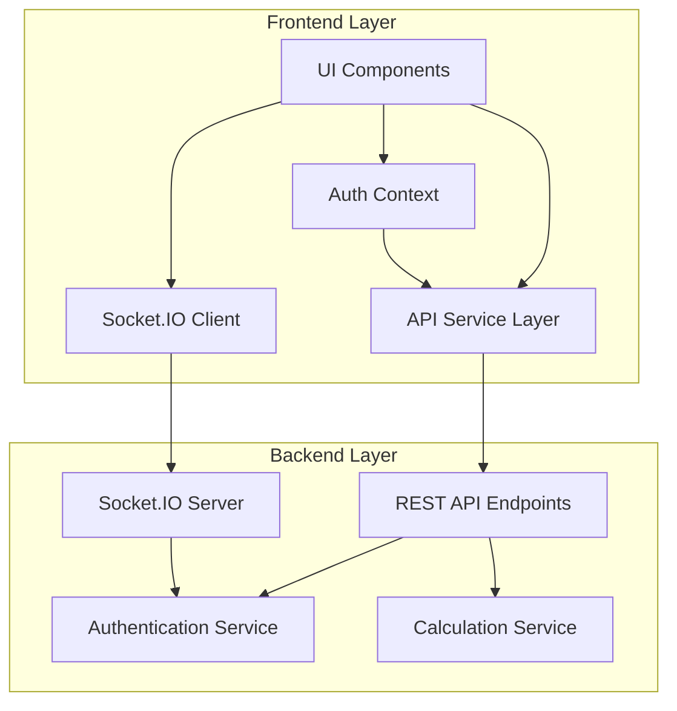
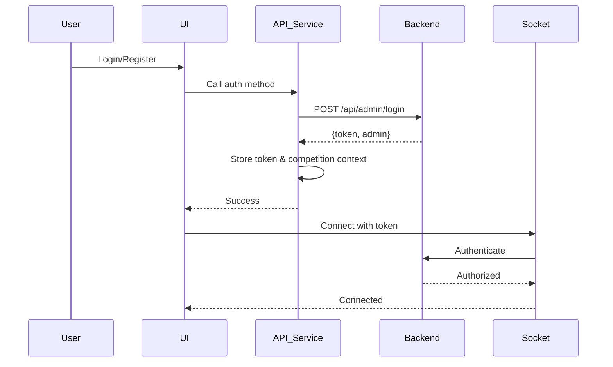
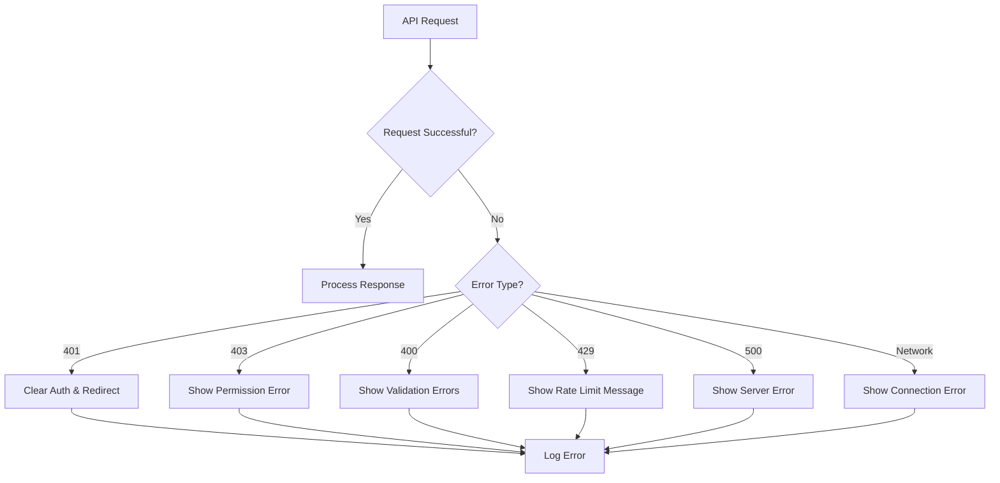

# Design Document: Frontend API Migration Adaptation

## Overview

This design document outlines the technical approach for adapting the Mallakhamb Web frontend to support the new backend API changes introduced in the "Old-Config Migration Updates". The migration encompasses seven major areas: admin authentication, judge login updates, public API endpoints, Socket.IO authorization, enhanced score saving with automatic calculation, super admin player management, and Razorpay webhook integration.

### Goals

1. **Seamless Integration**: Update frontend to consume new backend endpoints without breaking existing functionality
2. **Enhanced Security**: Implement proper authentication flows with account lockout and rate limiting support
3. **Improved User Experience**: Display calculated scores automatically and provide clear error messages
4. **Backward Compatibility**: Maintain support for existing API patterns while adopting new conventions
5. **Real-time Updates**: Ensure Socket.IO authorization changes are properly handled

### Non-Goals

- Redesigning the UI/UX of existing pages
- Implementing new features beyond API migration requirements
- Modifying backend API behavior
- Creating new user roles or permissions

## Architecture

### High-Level Architecture



### Component Interaction Flow



### Layered Architecture

The frontend follows a layered architecture pattern:

1. **Presentation Layer** (UI Components)
   - React components for user interaction
   - Form validation and user feedback
   - Real-time updates via Socket.IO

2. **Service Layer** (API Service)
   - Centralized API communication
   - Token management and injection
   - Request/response transformation
   - Cache management

3. **State Management Layer** (Context API)
   - Authentication state
   - Competition context
   - User profile data

4. **Utility Layer**
   - Secure storage
   - Logging
   - Validation schemas

## Components and Interfaces

### 1. API Service Layer Updates (`Web/src/services/api.js`)

#### Admin API Methods

```typescript
interface AdminAPI {
  // New methods
  register(data: AdminRegisterData): Promise<AuthResponse>;
  login(data: AdminLoginData): Promise<AuthResponse>;
  
  // Existing methods (unchanged)
  getProfile(): Promise<AdminProfile>;
  getDashboard(): Promise<DashboardData>;
  getAllTeams(params?: QueryParams): Promise<TeamsResponse>;
  // ... other existing methods
}

interface AdminRegisterData {
  name: string;
  email: string;
  password: string; // Min 12 characters
}

interface AdminLoginData {
  email: string;
  password: string;
}

interface AuthResponse {
  success: boolean;
  data: {
    token: string;
    admin: AdminProfile;
  };
}
```

#### Judge API Methods (Updated)

```typescript
interface JudgeAPI {
  // Public endpoints (no auth required)
  getCompetitions(): Promise<CompetitionsResponse>;
  getJudges(params?: JudgeQueryParams): Promise<JudgesResponse>;
  getSubmittedTeams(params?: TeamQueryParams): Promise<TeamsResponse>;
  saveScore(data: ScoreData): Promise<ScoreResponse>;
}

// Judge login now handled separately with username
interface JudgeLoginData {
  username: string; // Changed from email
  password: string;
}

interface JudgeLoginResponse {
  success: boolean;
  data: {
    token: string;
    judge: JudgeProfile;
  };
  message: string;
}

interface JudgeProfile {
  _id: string;
  username: string;
  judgeType: string;
  gender: string;
  ageGroup: string;
  competitionTypes: string[];
  competition: {
    id: string;
    name: string;
    level: string;
    place: string;
    status: string;
  };
}
```

#### Public API Methods

```typescript
interface PublicAPI {
  getTeams(): Promise<TeamsResponse>;
  getScores(params: ScoreQueryParams): Promise<ScoresResponse>;
}

interface ScoreQueryParams {
  teamId?: string;
  gender?: string;
  ageGroup?: string;
  competitionType?: string;
}
```

#### Super Admin API Methods (Updated)

```typescript
interface SuperAdminAPI extends AdminAPI {
  // New method
  addPlayerToTeam(data: PlayerAddData): Promise<PlayerResponse>;
  
  // Existing methods
  getDashboard(params?: QueryParams): Promise<DashboardData>;
  getSystemStats(): Promise<SystemStats>;
  // ... other existing methods
}

interface PlayerAddData {
  firstName: string;
  lastName: string;
  email: string;
  dateOfBirth: string; // ISO date string
  gender: 'Male' | 'Female';
  teamId: string;
  competitionId: string;
  password: string; // Min 12 characters
}

interface PlayerResponse {
  success: boolean;
  data: {
    id: string;
    firstName: string;
    lastName: string;
    email: string;
    team: string;
  };
}
```

#### Enhanced Score Saving Response

```typescript
interface ScoreSaveResponse {
  success: boolean;
  data: {
    scoreId: string;
    isLocked: boolean;
    playerScores: CalculatedPlayerScore[];
  };
}

interface CalculatedPlayerScore {
  playerId: string;
  playerName: string;
  time: string;
  judgeScores: {
    seniorJudge: number;
    judge1: number;
    judge2: number;
    judge3: number;
    judge4: number;
  };
  executionAverage: number;      // NEW: Calculated by backend
  baseScore: number;              // NEW: Calculated by backend
  baseScoreApplied: boolean;      // NEW: Indicates if base score was used
  toleranceUsed: number;          // NEW: Tolerance value applied
  averageMarks: number;           // NEW: Final average after tolerance
  deduction: number;
  otherDeduction: number;
  finalScore: number;             // NEW: Calculated final score
}
```

### 2. Admin Registration Component (`Web/src/pages/admin/AdminRegister.jsx`)

#### Component Structure

```typescript
interface AdminRegisterProps {
  // No props needed - standalone page
}

interface AdminRegisterFormData {
  name: string;
  email: string;
  password: string;
  confirmPassword: string;
}

interface AdminRegisterState {
  loading: boolean;
  showPassword: boolean;
  showConfirmPassword: boolean;
}
```

#### Component Features

- Form validation using react-hook-form
- Password strength indicator
- Password confirmation matching
- Email format validation
- 12+ character password requirement
- Rate limiting error handling
- Redirect to dashboard on success
- Link to login page for existing users

### 3. UnifiedLogin Component Updates (`Web/src/pages/unified/UnifiedLogin.jsx`)

#### Judge Login Changes

```typescript
// Current implementation uses email
interface OldJudgeLoginData {
  email: string;
  password: string;
}

// New implementation uses username
interface NewJudgeLoginData {
  username: string;
  password: string;
}
```

#### Competition Context Extraction

```typescript
// After successful judge login
const handleJudgeLogin = async (data: NewJudgeLoginData) => {
  const response = await axios.post('/judge/login', {
    username: data.username.toLowerCase(),
    password: data.password
  });
  
  // Extract competition context from judge profile
  const { token, judge } = response.data;
  const competitionId = judge.competition?.id;
  
  // Store token and competition context
  secureStorage.setItem('judge_token', token);
  secureStorage.setItem('judge_user', JSON.stringify(judge));
  secureStorage.setItem('judge_competition_id', competitionId);
  
  // Update auth context
  login(judge, token, 'judge');
};
```

#### Account Lockout Handling

```typescript
// Error handling for account lockout
try {
  await adminAPI.login(credentials);
} catch (error) {
  if (error.response?.status === 429) {
    toast.error('Too many login attempts. Please wait 15 minutes.');
  } else if (error.response?.data?.message?.includes('locked')) {
    toast.error('Account locked due to failed attempts. Try again in 15 minutes.');
  } else {
    toast.error(error.response?.data?.message || 'Login failed');
  }
}
```

### 4. Socket.IO Authorization Updates

#### Connection Setup with Authorization

```typescript
// Current implementation
const socket = io(socketUrl, {
  auth: {
    token: secureStorage.getItem('admin_token')
  }
});

// Authorization error handling
socket.on('connect_error', (error) => {
  if (error.message.includes('authorization') || error.message.includes('Unauthorized')) {
    toast.error('Not authorized to access scoring room');
    navigate('/admin/dashboard');
  }
});

// Room join authorization
socket.emit('join_scoring_room', roomId);

socket.on('error', (error) => {
  if (error.message === 'Not authorized to join this room') {
    toast.error('You do not have permission to access this scoring room');
    navigate('/admin/dashboard/scores');
  }
});
```

#### Score Update Authorization

```typescript
// Only judges can emit score updates
socket.on('score_update_error', (error) => {
  if (error.message === 'Only judges can update scores') {
    toast.error('Only judges can submit scores');
  }
});

// Scores saved authorization
socket.on('scores_saved_error', (error) => {
  if (error.message === 'Unauthorized to save scores') {
    toast.error('You do not have permission to save scores');
  }
});
```

### 5. AdminScoring Component Updates (`Web/src/pages/admin/AdminScoring.jsx`)

#### Score Calculation Display

```typescript
interface ScoreDisplayProps {
  playerScore: CalculatedPlayerScore;
}

const ScoreCalculationDisplay: React.FC<ScoreDisplayProps> = ({ playerScore }) => {
  return (
    <div className="score-breakdown">
      <div className="calculation-row">
        <span>Execution Average:</span>
        <span>{playerScore.executionAverage.toFixed(2)}</span>
      </div>
      
      {playerScore.baseScoreApplied && (
        <>
          <div className="calculation-row">
            <span>Base Score:</span>
            <span>{playerScore.baseScore.toFixed(2)}</span>
          </div>
          <div className="calculation-row warning">
            <span>Tolerance Applied:</span>
            <span>±{playerScore.toleranceUsed.toFixed(2)}</span>
          </div>
        </>
      )}
      
      <div className="calculation-row">
        <span>Average Marks:</span>
        <span>{playerScore.averageMarks.toFixed(2)}</span>
      </div>
      
      <div className="calculation-row">
        <span>Deductions:</span>
        <span>-{(playerScore.deduction + playerScore.otherDeduction).toFixed(2)}</span>
      </div>
      
      <div className="calculation-row final">
        <span>Final Score:</span>
        <span className="final-score">{playerScore.finalScore.toFixed(2)}</span>
      </div>
    </div>
  );
};
```

#### Save Scores Handler Update

```typescript
const handleSaveScores = async () => {
  try {
    const response = await api.saveScores(scoringData);
    
    // Extract calculated scores from response
    const { scoreId, isLocked, playerScores } = response.data;
    
    // Update local state with calculated values
    setCalculatedScores(playerScores);
    setIsLocked(isLocked);
    setExistingScoreId(scoreId);
    
    // Display success message with calculation info
    toast.success(
      isLocked 
        ? '🎉 Scores saved and locked! Calculations complete.' 
        : 'Scores saved as draft with automatic calculations.'
    );
    
    // Show calculation summary
    playerScores.forEach(ps => {
      if (ps.baseScoreApplied) {
        toast.info(
          `${ps.playerName}: Base score applied (tolerance: ±${ps.toleranceUsed})`,
          { duration: 4000 }
        );
      }
    });
    
  } catch (error) {
    logger.error('Error saving scores:', error);
    toast.error(error.response?.data?.message || 'Failed to save scores');
  }
};
```

### 6. Super Admin Player Management Component

#### AddPlayerForm Component (`Web/src/components/superadmin/AddPlayerForm.jsx`)

```typescript
interface AddPlayerFormProps {
  teams: Team[];
  competitions: Competition[];
  onSuccess: (player: Player) => void;
}

interface AddPlayerFormData {
  firstName: string;
  lastName: string;
  email: string;
  dateOfBirth: string;
  gender: 'Male' | 'Female';
  teamId: string;
  competitionId: string;
  password: string;
  confirmPassword: string;
}

const AddPlayerForm: React.FC<AddPlayerFormProps> = ({ teams, competitions, onSuccess }) => {
  const { register, handleSubmit, formState: { errors }, watch } = useForm<AddPlayerFormData>();
  const [loading, setLoading] = useState(false);
  
  const onSubmit = async (data: AddPlayerFormData) => {
    setLoading(true);
    try {
      const response = await superAdminAPI.addPlayerToTeam({
        firstName: data.firstName,
        lastName: data.lastName,
        email: data.email,
        dateOfBirth: data.dateOfBirth,
        gender: data.gender,
        teamId: data.teamId,
        competitionId: data.competitionId,
        password: data.password
      });
      
      toast.success(`Player ${data.firstName} ${data.lastName} added successfully`);
      onSuccess(response.data);
    } catch (error) {
      if (error.response?.data?.message?.includes('email already exists')) {
        toast.error('Player email already exists');
      } else if (error.response?.data?.message?.includes('Team not found')) {
        toast.error('Team not found in the specified competition');
      } else {
        toast.error(error.response?.data?.message || 'Failed to add player');
      }
    } finally {
      setLoading(false);
    }
  };
  
  return (
    <form onSubmit={handleSubmit(onSubmit)}>
      {/* Form fields */}
    </form>
  );
};
```

### 7. Error Handling and User Feedback

#### Centralized Error Handler

```typescript
interface APIError {
  status: number;
  message: string;
  code?: string;
  details?: any;
}

const handleAPIError = (error: any, context: string): void => {
  logger.error(`${context} error:`, error);
  
  if (!error.response) {
    toast.error('Network error. Please check your connection.');
    return;
  }
  
  const { status, data } = error.response;
  
  switch (status) {
    case 400:
      // Validation errors
      if (data.errors && Array.isArray(data.errors)) {
        data.errors.forEach((err: any) => {
          toast.error(`${err.field}: ${err.message}`);
        });
      } else {
        toast.error(data.message || 'Invalid request');
      }
      break;
      
    case 401:
      toast.error('Session expired. Please login again.');
      // Redirect handled by interceptor
      break;
      
    case 403:
      if (data.message?.includes('competition')) {
        toast.error('Competition context error. Please select a competition.');
      } else {
        toast.error('You do not have permission to perform this action.');
      }
      break;
      
    case 429:
      const waitTime = data.retryAfter || 900; // 15 minutes default
      toast.error(`Too many requests. Please wait ${Math.ceil(waitTime / 60)} minutes.`);
      break;
      
    case 500:
      toast.error('Server error. Please try again later.');
      break;
      
    default:
      toast.error(data.message || 'An error occurred');
  }
};
```

#### Account Lockout Display

```typescript
interface AccountLockoutMessageProps {
  lockoutEndTime: Date;
}

const AccountLockoutMessage: React.FC<AccountLockoutMessageProps> = ({ lockoutEndTime }) => {
  const [timeRemaining, setTimeRemaining] = useState('');
  
  useEffect(() => {
    const interval = setInterval(() => {
      const now = new Date();
      const diff = lockoutEndTime.getTime() - now.getTime();
      
      if (diff <= 0) {
        setTimeRemaining('Account unlocked');
        clearInterval(interval);
      } else {
        const minutes = Math.floor(diff / 60000);
        const seconds = Math.floor((diff % 60000) / 1000);
        setTimeRemaining(`${minutes}:${seconds.toString().padStart(2, '0')}`);
      }
    }, 1000);
    
    return () => clearInterval(interval);
  }, [lockoutEndTime]);
  
  return (
    <div className="lockout-message">
      <AlertCircle className="icon" />
      <div>
        <p className="title">Account Temporarily Locked</p>
        <p className="description">
          Too many failed login attempts. Please try again in {timeRemaining}.
        </p>
      </div>
    </div>
  );
};
```

## Data Models

### Token Structure

```typescript
interface JWTPayload {
  userId: string;
  role: 'admin' | 'superadmin' | 'judge' | 'coach' | 'player';
  competitionId?: string; // Optional competition context
  iat: number;
  exp: number;
}
```

### Secure Storage Keys

```typescript
const STORAGE_KEYS = {
  // Tokens
  ADMIN_TOKEN: 'admin_token',
  SUPERADMIN_TOKEN: 'superadmin_token',
  JUDGE_TOKEN: 'judge_token',
  COACH_TOKEN: 'coach_token',
  PLAYER_TOKEN: 'player_token',
  
  // User profiles
  ADMIN_USER: 'admin_user',
  SUPERADMIN_USER: 'superadmin_user',
  JUDGE_USER: 'judge_user',
  COACH_USER: 'coach_user',
  PLAYER_USER: 'player_user',
  
  // Competition context
  COMPETITION_ID: 'competition_id',
  JUDGE_COMPETITION_ID: 'judge_competition_id',
};
```

### Score Calculation Models

```typescript
interface ScoreCalculation {
  executionScores: number[];      // J1-J4 scores
  seniorJudgeScore: number;       // Senior judge score
  executionAverage: number;       // Calculated average
  tolerance: number;              // Based on execution average
  baseScore: number;              // (execution + senior) / 2
  baseScoreApplied: boolean;      // Whether base score was used
  averageMarks: number;           // Final average after tolerance
  deduction: number;              // Time deduction
  otherDeduction: number;         // Other deductions
  finalScore: number;             // averageMarks - deductions
}

// Tolerance calculation rules
const getToleranceForScore = (score: number): number => {
  if (score >= 9.0) return 0.10;
  if (score >= 8.0) return 0.20;
  if (score >= 7.0) return 0.30;
  if (score >= 6.0) return 0.40;
  if (score >= 5.0) return 0.50;
  return 1.00;
};
```

## Error Handling

### Error Categories

1. **Authentication Errors (401)**
   - Expired token
   - Invalid credentials
   - Missing token
   - Action: Redirect to login, clear storage

2. **Authorization Errors (403)**
   - Insufficient permissions
   - Invalid competition context
   - Action: Display error, redirect to appropriate page

3. **Validation Errors (400)**
   - Invalid input format
   - Missing required fields
   - Password too short
   - Action: Display field-specific errors

4. **Rate Limiting Errors (429)**
   - Too many login attempts
   - Too many API requests
   - Action: Display wait time, disable form

5. **Account Lockout Errors**
   - Failed login attempts exceeded
   - Action: Display lockout duration, show countdown

6. **Network Errors**
   - Connection timeout
   - Server unreachable
   - Action: Display generic error, suggest retry

### Error Handling Strategy



### Retry Logic

```typescript
interface RetryConfig {
  maxRetries: number;
  retryDelay: number;
  retryableStatuses: number[];
}

const defaultRetryConfig: RetryConfig = {
  maxRetries: 3,
  retryDelay: 1000,
  retryableStatuses: [408, 429, 500, 502, 503, 504]
};

const retryRequest = async (
  requestFn: () => Promise<any>,
  config: RetryConfig = defaultRetryConfig
): Promise<any> => {
  let lastError: any;
  
  for (let attempt = 0; attempt <= config.maxRetries; attempt++) {
    try {
      return await requestFn();
    } catch (error) {
      lastError = error;
      
      const status = error.response?.status;
      const isRetryable = config.retryableStatuses.includes(status);
      
      if (!isRetryable || attempt === config.maxRetries) {
        throw error;
      }
      
      // Exponential backoff
      const delay = config.retryDelay * Math.pow(2, attempt);
      await new Promise(resolve => setTimeout(resolve, delay));
    }
  }
  
  throw lastError;
};
```

## Testing Strategy

### Unit Tests

1. **API Service Tests**
   - Test all new API methods (register, login, addPlayerToTeam)
   - Mock axios responses
   - Verify request payloads
   - Test error handling

2. **Component Tests**
   - AdminRegister form validation
   - UnifiedLogin username field for judges
   - AddPlayerForm validation
   - Error message display

3. **Utility Tests**
   - Token extraction and validation
   - Competition context management
   - Error handler logic

### Integration Tests

1. **Authentication Flow**
   - Admin registration → login → dashboard
   - Judge login with username → scoring page
   - Token storage and retrieval

2. **Score Saving Flow**
   - Submit scores → receive calculations → display results
   - Lock/unlock scores
   - Real-time updates via Socket.IO

3. **Super Admin Flow**
   - Add player → verify transaction → confirm team roster

### End-to-End Tests

1. **Admin Registration Journey**
   - Navigate to register page
   - Fill form with valid data
   - Submit and verify redirect
   - Verify token storage

2. **Judge Scoring Journey**
   - Login with username
   - Join scoring room
   - Submit scores
   - Verify real-time updates

3. **Public Scores Journey**
   - Navigate to public scores
   - Select filters
   - View calculated scores
   - Verify no authentication required

### Manual Testing Checklist

- [ ] Admin can register with 12+ character password
- [ ] Admin login shows account lockout after 5 failed attempts
- [ ] Judge can login with username instead of email
- [ ] Judge profile shows competition context
- [ ] Public scores page loads without authentication
- [ ] Socket.IO rejects unauthorized users from scoring rooms
- [ ] Score saving returns calculated values
- [ ] Calculated scores display correctly in UI
- [ ] Super admin can add players to teams
- [ ] Error messages are clear and actionable
- [ ] Rate limiting displays appropriate wait times
- [ ] Token expiry redirects to login

## Deployment Considerations

### Environment Variables

```bash
# Frontend (.env)
VITE_API_URL=https://api.example.com/api
VITE_SOCKET_URL=https://api.example.com

# Backend (already configured)
RAZORPAY_WEBHOOK_SECRET=your_webhook_secret
JWT_SECRET=your_jwt_secret
```

### Migration Steps

1. **Phase 1: API Service Updates**
   - Update `api.js` with new methods
   - Add judge login endpoint
   - Add public API methods
   - Deploy and test

2. **Phase 2: Component Updates**
   - Create AdminRegister component
   - Update UnifiedLogin for judges
   - Update AdminScoring for calculations
   - Deploy and test

3. **Phase 3: Socket.IO Updates**
   - Update authorization handling
   - Add error event listeners
   - Test real-time updates
   - Deploy and test

4. **Phase 4: Super Admin Features**
   - Create AddPlayerForm component
   - Integrate into SuperAdminManagement
   - Test atomic transactions
   - Deploy and test

### Rollback Plan

If issues arise during deployment:

1. **Immediate Rollback**
   - Revert frontend to previous version
   - Backend remains compatible with old frontend

2. **Partial Rollback**
   - Disable new features via feature flags
   - Keep existing functionality working

3. **Data Integrity**
   - No database migrations required
   - All changes are additive
   - Existing data remains valid

### Monitoring

1. **Error Tracking**
   - Monitor 401/403 errors for auth issues
   - Track 429 errors for rate limiting
   - Log Socket.IO connection failures

2. **Performance Metrics**
   - API response times
   - Socket.IO connection latency
   - Score calculation time

3. **User Metrics**
   - Admin registration success rate
   - Judge login success rate
   - Score save success rate

## Security Considerations

### Authentication Security

1. **Password Requirements**
   - Minimum 12 characters
   - Enforced on both frontend and backend
   - Clear error messages for users

2. **Account Lockout**
   - 5 failed attempts trigger lockout
   - 15-minute lockout duration
   - Countdown timer displayed to user

3. **Rate Limiting**
   - 5 requests per 15 minutes for auth endpoints
   - 429 status code with retry-after header
   - Clear messaging to users

### Token Security

1. **Secure Storage**
   - Use secureStorage utility (encrypted localStorage)
   - Separate tokens per user type
   - Clear tokens on logout

2. **Token Validation**
   - Check expiry before requests
   - Automatic refresh on expiry
   - Redirect to login if invalid

3. **Competition Context**
   - Extracted from JWT payload
   - Included in x-competition-id header
   - Validated on backend

### Socket.IO Security

1. **Connection Authentication**
   - Token required in auth object
   - Validated on connection
   - Rejected if invalid

2. **Room Authorization**
   - Role-based access control
   - Judges, admins, superadmins only
   - Error events for unauthorized access

3. **Event Authorization**
   - Score updates: judges only
   - Scores saved: judges, admins, superadmins
   - Clear error messages

### Input Validation

1. **Frontend Validation**
   - Email format
   - Password strength
   - Required fields
   - Date formats

2. **Backend Validation**
   - All inputs validated
   - SQL injection prevention
   - XSS prevention
   - CSRF protection

## Backward Compatibility

### API Compatibility

1. **Route Aliases**
   - `/api/superadmin` and `/api/super-admin` both work
   - Frontend uses new prefix by default
   - Old routes remain functional

2. **Existing Methods**
   - All existing API methods unchanged
   - New methods added alongside old ones
   - No breaking changes

3. **Response Formats**
   - Existing response structures maintained
   - New fields added to responses
   - Old clients ignore new fields

### Component Compatibility

1. **UnifiedLogin**
   - Supports both email and username
   - Role detection determines field type
   - Existing login flows unchanged

2. **AdminScoring**
   - Displays calculated scores if available
   - Falls back to manual calculation if not
   - Existing scoring logic preserved

3. **API Service**
   - Maintains existing axios interceptors
   - Cache invalidation patterns unchanged
   - Error handling enhanced, not replaced

## Future Enhancements

### Potential Improvements

1. **Enhanced Score Display**
   - Visual breakdown of calculations
   - Comparison with previous scores
   - Historical trends

2. **Real-time Notifications**
   - Push notifications for score updates
   - Email notifications for account lockout
   - SMS for critical events

3. **Advanced Error Recovery**
   - Automatic retry with exponential backoff
   - Offline mode with queue
   - Conflict resolution for concurrent edits

4. **Performance Optimizations**
   - Request batching
   - Response caching strategies
   - Lazy loading for large datasets

5. **Accessibility Improvements**
   - Screen reader support
   - Keyboard navigation
   - High contrast mode

### Technical Debt

1. **Refactoring Opportunities**
   - Consolidate duplicate code in API service
   - Extract common form validation logic
   - Standardize error handling patterns

2. **Testing Gaps**
   - Add more integration tests
   - Increase unit test coverage
   - Add visual regression tests

3. **Documentation**
   - API service method documentation
   - Component prop documentation
   - Error code reference guide

## Conclusion

This design provides a comprehensive approach to adapting the frontend for the new backend API changes. The implementation maintains backward compatibility while introducing new features and improving security. The layered architecture ensures separation of concerns, and the error handling strategy provides clear feedback to users.

Key success factors:
- Minimal disruption to existing functionality
- Clear error messages and user feedback
- Proper authentication and authorization
- Real-time updates via Socket.IO
- Automatic score calculations
- Comprehensive testing strategy

The phased deployment approach allows for incremental rollout and easy rollback if issues arise. Monitoring and logging ensure quick identification and resolution of any problems.
