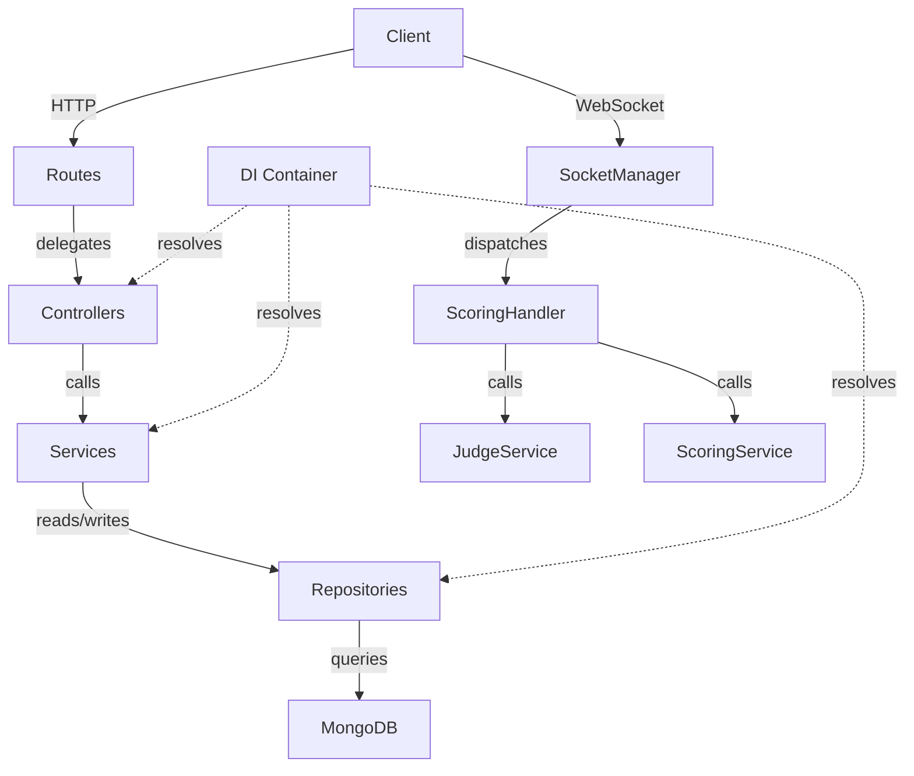

# Design Document: Old-Config Migration

## Overview

This migration brings the remaining functionality from `Server/old-config/` into the new layered architecture under `Server/src/`. The new architecture enforces a strict separation of concerns: controllers handle HTTP, services hold business logic, repositories own data access, and the DI container wires everything together.

Six concrete gaps exist between the old and new configurations:

1. **Route prefix mismatch** – `loadRoutes` mounts the super-admin router at `/api/super-admin` but the frontend calls `/api/superadmin`. The public router (`/api/public`) is missing entirely.
2. **Missing admin auth endpoints** – `POST /api/admin/register` and `POST /api/admin/login` are absent from `admin.routes.js`.
3. **Judge login credential type** – `JudgeService.loginJudge` currently accepts `email` as the first argument; the old system (and the frontend) passes `username`.
4. **Socket.IO event authorization** – `ScoringHandler` allows coaches and players to join scoring rooms; the old config restricts this to judges, admins, and superadmins only.
5. **Score-saving pipeline** – `AdminService` lacks a `saveScores` method that delegates to `CalculationService`.
6. **Super-admin add-player endpoint** – `POST /api/superadmin/players/add` is absent from `super-admin.routes.js` and `SuperAdminService`.

Security middleware (helmet, mongoSanitize, compression, rate limiting, HTTPS redirect, raw-body capture) is already present in `Server/server.js` and requires no changes.

---

## Architecture

The migration follows the existing layered pattern without introducing new layers or packages.



All changes are additive or corrective within existing files. No new layers, no new npm packages.

---

## Components and Interfaces

### 1. Route Loader (`Server/src/routes/index.js`)

**Change**: Mount `superAdminRoutes` at both `/api/super-admin` (existing) and `/api/superadmin` (new alias). Mount a new `publicRouter` at `/api/public`.

```js
// Existing (keep)
app.use('/api/super-admin', superAdminRoutes);

// Add alias
app.use('/api/superadmin', superAdminRoutes);

// Add public router
const publicRouter = createPublicRoutes(container);
app.use('/api/public', publicRouter);
```

Rate-limiter application for the `/api/superadmin/login` path is already handled by the existing `superAdminAuthRouter` block (which already targets `/api/superadmin`).

### 2. Public Router (`Server/src/routes/public.routes.js`) — new file

Serves unauthenticated endpoints. Optional JWT parsing (no hard auth requirement) is applied via an `optionalAuth` middleware so that endpoints that benefit from competition context can use it.

| Method | Path | Handler | Auth |
|--------|------|---------|------|
| GET | `/competitions` | `adminController.getPublicCompetitions` | None |
| GET | `/judges` | `adminController.getJudges` (with optional competition context) | Optional |
| GET | `/submitted-teams` | `adminController.getSubmittedTeams` | Optional |
| GET | `/teams` | `adminController.getPublicTeams` | None |
| GET | `/scores` | `adminController.getPublicScores` | None |
| POST | `/save-score` | `adminController.saveScores` | Optional |
| POST | `/payments/razorpay/webhook` | `paymentController.reconcileRazorpayWebhook` | None |

The `optionalAuth` middleware attempts to verify the JWT from the `Authorization` header. If valid, it populates `req.user` and `req.competitionId`; if absent or invalid, it continues without error.

### 3. Admin Routes (`Server/src/routes/admin.routes.js`)

**Change**: Add two new routes before the existing `authMiddleware` guard.

```js
// Add at the top of createAdminRoutes, before the auth guard
router.post('/register', adminController.registerAdmin);
router.post('/login', adminController.loginAdmin);
```

### 4. Admin Controller (`Server/src/controllers/admin.controller.js`)

**Change**: Add two new handler methods.

```js
/** @route POST /api/admin/register */
registerAdmin: asyncHandler(async (req, res) => {
  const result = await adminService.registerAdmin(req.body);
  res.status(201).json({ success: true, data: result });
}),

/** @route POST /api/admin/login */
loginAdmin: asyncHandler(async (req, res) => {
  const { email, password } = req.body;
  const result = await adminService.loginAdmin(email, password, req);
  res.json({ success: true, data: result });
}),
```

### 5. Admin Service (`Server/src/services/user/admin.service.js`)

**Change**: Add `registerAdmin`, `loginAdmin`, and `saveScores` methods.

`registerAdmin(data)` — delegates to `AuthenticationService.register(data, 'admin')`.

`loginAdmin(email, password, req)` — delegates to `AuthenticationService.login(email, password, 'admin')` with account-lockout checks.

`saveScores(scoreData)` — the core new method:

```
saveScores({
  teamId, gender, ageGroup, competitionType,
  playerScores, judgeDetails, competitionId,
  timeKeeper, scorer, remarks, isLocked
})
```

1. Validate required fields (`teamId`, `gender`, `ageGroup`, `playerScores`).
2. For each player score, call `this.calculationService.calculateCompletePlayerScore(playerScore)` to compute `executionAverage`, `baseScore`, `baseScoreApplied`, `toleranceUsed`, `averageMarks`, and `finalScore`.
3. Upsert the `Score` document via `this.scoreRepository` (find by `{ teamId, gender, ageGroup, competition: competitionId }`, update if found, create if not).
4. Return `{ scoreId, isLocked, playerScores }`.

### 6. Judge Service (`Server/src/services/user/judge.service.js`)

**Change**: Update `loginJudge` to accept `username` as the lookup key instead of `email`.

Current signature: `loginJudge(email, password, competitionId)`

New behaviour: the first argument is treated as a `username`. The repository call changes from `findByEmail(email)` to `findByUsername(username)` (case-insensitive). The `competitionId` parameter becomes optional — if omitted, the judge's assigned competition is used automatically (matching old-config behaviour where the judge's competition is embedded in the JWT).

```js
async loginJudge(username, password) {
  const judge = await this.judgeRepository.findByUsername(username.toLowerCase());
  // ... password check, lockout, token generation with judge.competition
}
```

The `JudgeRepository` must expose `findByUsername(username)` — a case-insensitive query on the `username` field.

### 7. Judge Controller (`Server/src/controllers/judge.controller.js`)

**Change**: Update the `login` handler to pass `username` (not `email`) to `judgeService.loginJudge`.

```js
login: asyncHandler(async (req, res) => {
  const { username, password } = req.body;
  const result = await judgeService.loginJudge(username, password);
  res.json({ success: true, data: result, message: 'Login successful' });
}),
```

### 8. Scoring Handler (`Server/src/socket/handlers/scoring.handler.js`)

**Change**: Restrict `join_scoring_room` to judges, admins, and superadmins only. Remove the coach/player branch.

```js
const validator = async (socket, roomId) => {
  return ['judge', 'admin', 'superadmin'].includes(socket.userType);
};
```

The `handleScoreUpdate` and `handleScoresSaved` authorization checks are already correct.

### 9. Super Admin Routes (`Server/src/routes/super-admin.routes.js`)

**Change**: Add the `POST /players/add` endpoint.

```js
router.post('/players/add', auth, requireSuperAdmin, controller.addPlayer);
```

### 10. Super Admin Controller (`Server/src/controllers/super_admin.controller.js`)

**Change**: Add `addPlayer` handler.

```js
addPlayer: asyncHandler(async (req, res) => {
  const player = await superAdminService.addPlayer(req.body, req.user._id);
  res.status(201).json({ success: true, data: player });
}),
```

### 11. Super Admin Service (`Server/src/services/user/super-admin.service.js`)

**Change**: Add `addPlayer(data, superAdminId)` method.

```
addPlayer({ firstName, lastName, email, dateOfBirth, gender, teamId, competitionId, password }, superAdminId)
```

1. Verify `teamId` belongs to `competitionId` (query `Competition.registeredTeams`).
2. Check player email uniqueness.
3. Open a MongoDB session and run a transaction:
   a. Create `Player` document.
   b. Create `Transaction` document with `{ source: 'superadmin', type: 'player_add', amount: 0, competition: competitionId, team: teamId }`.
4. Return `{ id, firstName, lastName, email, team: teamId }`.

### 12. Payment Service (`Server/src/services/payment/payment.service.js`)

**Change**: Update `reconcileWebhook` to handle `payment.captured` and `payment.failed` events by updating the matching team's `paymentStatus` in the `Competition.registeredTeams` subdocument, mirroring the old-config logic. The existing HMAC verification using `crypto.timingSafeEqual` is already correct.

The `verifySignature` method already uses `computed === signature` (string equality). This must be changed to use `crypto.timingSafeEqual` on `Buffer` instances to prevent timing attacks, matching the old-config implementation.

---

## Data Models

No schema changes are required. All models (`Admin`, `Judge`, `Score`, `Player`, `Transaction`, `Competition`) already exist in `Server/models/`.

Key field references:

| Model | Relevant Fields |
|-------|----------------|
| `Judge` | `username` (String, lowercase), `password` (bcrypt), `judgeType`, `gender`, `ageGroup`, `competitionTypes`, `competition` (ref) |
| `Score` | `teamId`, `gender`, `ageGroup`, `competition`, `competitionType`, `playerScores[]`, `isLocked` |
| `Score.playerScores[]` | `playerId`, `playerName`, `judgeScores`, `executionAverage`, `baseScore`, `baseScoreApplied`, `toleranceUsed`, `averageMarks`, `deduction`, `otherDeduction`, `finalScore` |
| `Transaction` | `competition`, `team`, `coach`, `source`, `type`, `amount`, `paymentStatus` |
| `Competition.registeredTeams[]` | `team`, `coach`, `players[]`, `isSubmitted`, `paymentStatus`, `paymentOrderId`, `paymentId` |

### Score Calculation Pipeline

```
judgeScores → calculateCompletePlayerScore(playerScore, options)
  ├── executionAverage = avg(middle two of [judge1..judge4])
  ├── baseScoreApplied = (max - min of judge1..judge4) > tolerance
  ├── averageMarks = baseScoreApplied ? baseScore : executionAverage
  └── finalScore = max(0, averageMarks - deduction - otherDeduction)
```

---

## Correctness Properties

*A property is a characteristic or behavior that should hold true across all valid executions of a system — essentially, a formal statement about what the system should do. Properties serve as the bridge between human-readable specifications and machine-verifiable correctness guarantees.*

### Property 1: Weak password rejection is universal

*For any* string that fails the password strength validation rules (e.g., too short, missing uppercase, missing digit), submitting it to `POST /api/admin/register` should return HTTP 400 with validation errors, and no admin account should be created.

**Validates: Requirements 2.6**

---

### Property 2: Judge username lookup is case-insensitive

*For any* judge stored with a given username, a login attempt using the same username in any combination of upper and lower case should find the same judge record and succeed (given the correct password).

**Validates: Requirements 4.4**

---

### Property 3: Judge login response always contains required fields

*For any* valid judge credential pair (username + password), the login response should always include `judgeType`, `gender`, `ageGroup`, `competitionTypes`, and a `competition` object with `id`, `name`, `level`, `place`, and `status`.

**Validates: Requirements 4.5**

---

### Property 4: Authorized user types can always join a scoring room

*For any* room ID string and any socket with `userType` in `['judge', 'admin', 'superadmin']`, emitting `join_scoring_room` should result in the socket joining the room (no error emitted).

**Validates: Requirements 5.2**

---

### Property 5: Unauthorized user types are always rejected from scoring rooms

*For any* room ID string and any socket with `userType` not in `['judge', 'admin', 'superadmin']`, emitting `join_scoring_room` should result in an `error` event being emitted to the socket.

**Validates: Requirements 5.3**

---

### Property 6: Non-judge score updates are always rejected

*For any* socket with `userType` not equal to `'judge'`, emitting `score_update` should result in an `error` event with the message "Only judges can update scores".

**Validates: Requirements 5.5**

---

### Property 7: Unauthorized scores_saved events are always rejected

*For any* socket with `userType` not in `['judge', 'admin', 'superadmin']`, emitting `scores_saved` should result in an `error` event with the message "Unauthorized to save scores".

**Validates: Requirements 5.7**

---

### Property 8: Score calculation always produces all required fields

*For any* valid `judgeScores` object (with `seniorJudge`, `judge1`–`judge4` values in [0, 10]), calling `CalculationService.calculateCompletePlayerScore` should return an object containing `executionAverage`, `baseScoreApplied`, `toleranceUsed`, `averageMarks`, and `finalScore`, all as non-negative numbers.

**Validates: Requirements 6.2**

---

### Property 9: Final score equals averageMarks minus deductions

*For any* `averageMarks >= 0`, `deduction >= 0`, and `otherDeduction >= 0`, the computed `finalScore` should equal `max(0, averageMarks - deduction - otherDeduction)`.

**Validates: Requirements 6.3**

---

### Property 10: Score upsert is idempotent

*For any* valid score payload, calling `saveScores` twice with the same `(teamId, gender, ageGroup, competitionId)` key should result in exactly one `Score` document in the database (the second call updates, not duplicates).

**Validates: Requirements 6.4**

---

### Property 11: Missing required score fields always return HTTP 400

*For any* subset of `{teamId, gender, ageGroup, playerScores}` that is missing at least one field, `POST /api/admin/scores` (or the equivalent save-score endpoint) should return HTTP 400.

**Validates: Requirements 6.7**

---

### Property 12: HMAC webhook signature verification is consistent

*For any* raw body string and webhook secret, computing `HMAC-SHA256(body, secret)` and then verifying the result against itself should always return `true`; verifying against any other string should return `false`.

**Validates: Requirements 7.1**

---

### Property 13: Unknown webhook event types are always ignored

*For any* event type string that is not `'payment.captured'` or `'payment.failed'`, a webhook request with a valid signature should return HTTP 200 with the message "Webhook event ignored".

**Validates: Requirements 7.5**

---

### Property 14: Forgot-password response is identical for all emails

*For any* email string (whether registered or not), `POST /api/auth/forgot-password` should return HTTP 200 with the same response body, preventing email enumeration.

**Validates: Requirements 9.2**

---

### Property 15: OTP password reset round-trip

*For any* registered user and any valid new password, the sequence `forgot-password → verify-otp → reset-password-otp → login` should succeed: the user can log in with the new password after the reset.

**Validates: Requirements 9.8**

---

### Property 16: NoSQL injection operators are sanitized in all request bodies

*For any* request body containing MongoDB operator keys (e.g., `$where`, `$gt`), the `mongoSanitize` middleware should replace those keys with `_` before the body reaches any route handler.

**Validates: Requirements 10.4**

---

### Property 17: Raw body is preserved for all requests

*For any* request body, `req.rawBody` should equal the original UTF-8 string of the request body, regardless of content.

**Validates: Requirements 10.6**

---

### Property 18: Super-admin player add is atomic

*For any* valid player creation payload, if the `Transaction` creation step fails, the `Player` document should also not be persisted (and vice versa). Both operations succeed together or neither does.

**Validates: Requirements 8.7**

---

### Property 19: Super-admin player transaction always has correct metadata

*For any* player added via `POST /api/superadmin/players/add`, the resulting `Transaction` document should have `source === 'superadmin'` and `amount === 0`.

**Validates: Requirements 8.6**

---

## Error Handling

All error handling follows the existing pattern in `Server/src/middleware/error.middleware.js`. Controllers use `asyncHandler` to forward errors to the global error handler.

| Scenario | HTTP Status | Message |
|----------|-------------|---------|
| Admin email already registered | 400 | "Admin with this email already exists" |
| Weak password | 400 | Validation errors array |
| Judge username not found | 400 | "Invalid credentials" |
| Judge account locked | 429 | Lockout message + `remainingTime` |
| Unauthorized socket event | — | `error` event emitted to socket |
| Missing score fields | 400 | "Missing required fields: ..." |
| Invalid webhook signature | 400 | "Invalid webhook signature" |
| Unknown webhook event | 200 | "Webhook event ignored" |
| No matching webhook order | 200 | "No matching order found" |
| Player email already exists (superadmin add) | 400 | "Player with this email already exists" |
| Team not in competition (superadmin add) | 400 | Descriptive message |
| OTP expired | 400 | "OTP has expired" |
| OTP threshold exceeded | 429 | Lockout duration |

---

## Testing Strategy

### Unit Tests

Each new or modified method gets a focused unit test using Jest (the existing test framework). Tests use mocked repositories and services.

Key unit test targets:

- `AdminService.saveScores` — happy path, upsert path, missing-fields path
- `AdminService.registerAdmin` / `loginAdmin` — delegation to `AuthenticationService`
- `JudgeService.loginJudge` — username lookup, case-insensitive, lockout, missing competition
- `ScoringHandler.handleJoinScoringRoom` — authorized types join, unauthorized types get error
- `PaymentService.reconcileWebhook` — captured/failed/unknown events, invalid signature
- `SuperAdminService.addPlayer` — happy path, duplicate email, team mismatch, transaction rollback
- `CalculationService.calculateCompletePlayerScore` — all output fields present, finalScore formula

### Property-Based Tests

Property-based tests use **fast-check** (already available in the Node.js ecosystem; add as a dev dependency if not present). Each property test runs a minimum of **100 iterations**.

Tag format: `// Feature: old-config-migration, Property N: <property text>`

| Property | Test Description |
|----------|-----------------|
| P1 | Generate random strings failing password rules → all return 400 |
| P2 | Generate random username casings → all find same judge |
| P3 | Generate random valid judge credentials → response always has required fields |
| P4 | Generate random roomIds + authorized userTypes → all join successfully |
| P5 | Generate random roomIds + unauthorized userTypes → all emit error |
| P6 | Generate random non-judge userTypes → score_update always emits error |
| P7 | Generate random unauthorized userTypes → scores_saved always emits error |
| P8 | Generate random judge score arrays in [0,10] → all required fields present and non-negative |
| P9 | Generate random (averageMarks, deduction, otherDeduction) → finalScore = max(0, avg - d - od) |
| P10 | Generate random score payloads → saving twice yields exactly one document |
| P11 | Generate random subsets of required fields with at least one missing → all return 400 |
| P12 | Generate random bodies + secrets → HMAC(body, secret) verifies against itself, not against other strings |
| P13 | Generate random event type strings not in known set → all return 200 + "ignored" |
| P14 | Generate random email strings → forgot-password always returns same response |
| P15 | Generate random registered users + new passwords → full OTP reset flow succeeds |
| P16 | Generate random request bodies with $ operators → all operators replaced with _ |
| P17 | Generate random request bodies → req.rawBody equals original body string |
| P18 | Simulate transaction failure → player document not persisted |
| P19 | Generate random valid player payloads → transaction always has source=superadmin, amount=0 |

### Integration Tests

- End-to-end route tests for each new endpoint using `supertest` against the Express app with a test MongoDB instance.
- Socket.IO integration tests using `socket.io-client` to verify real-time event flow.
- Webhook integration test: send a signed Razorpay payload and verify the team's `paymentStatus` is updated in the database.
