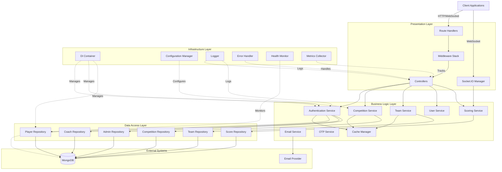
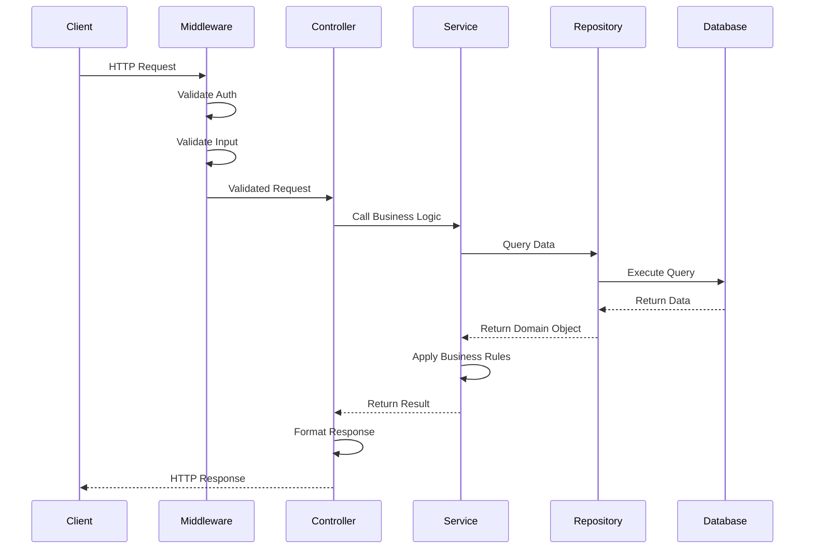
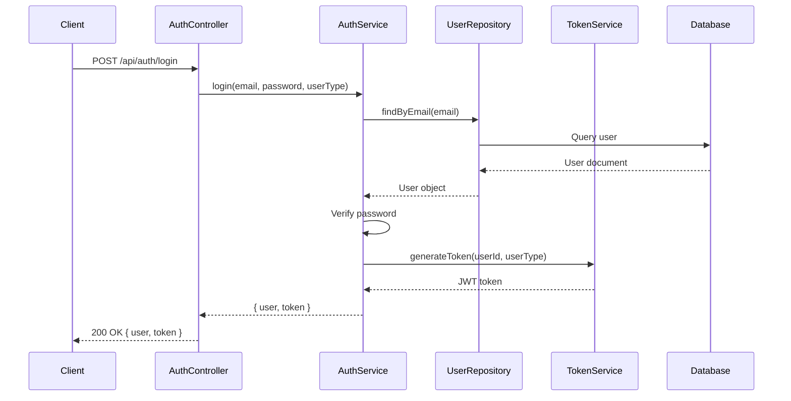
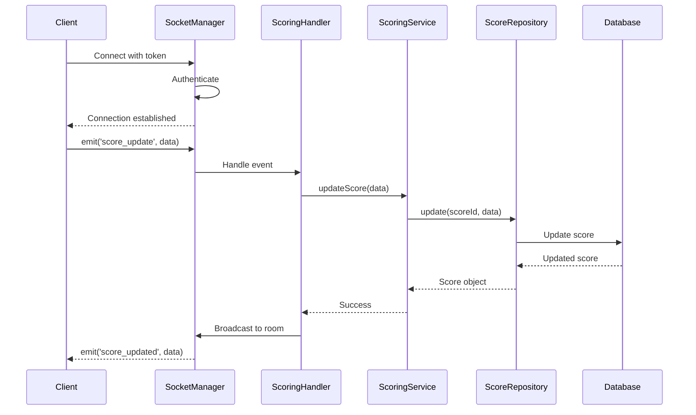
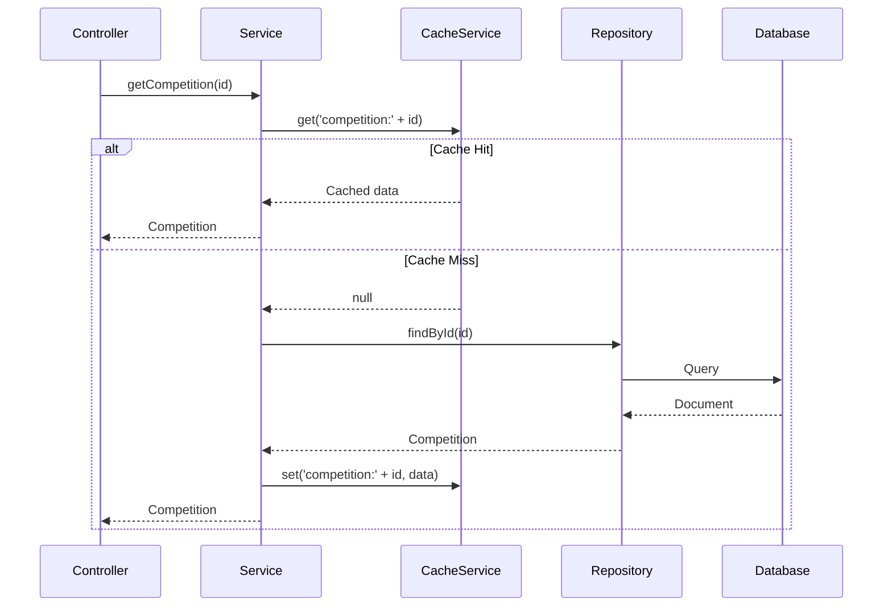
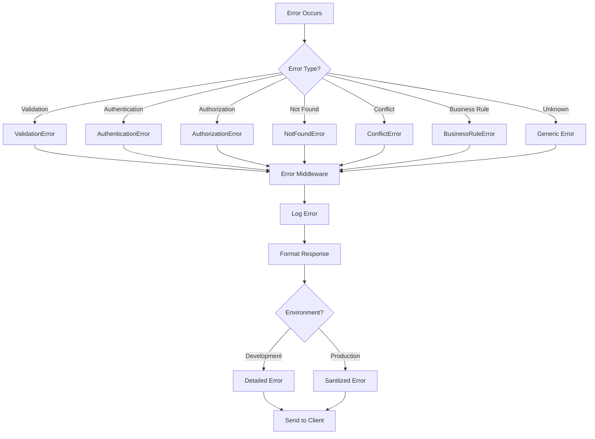

# Technical Design Document: Server Architecture Refactoring

## Overview

This document provides the technical design for refactoring the Mallakhamb Competition Management System backend from a monolithic architecture to a well-structured, layered architecture. The refactoring introduces service layer, repository pattern, dependency injection, and production-grade features while maintaining 100% backward compatibility with existing API contracts.

### Current Architecture Problems

- **Tight Coupling**: Controllers directly use Mongoose models, making testing difficult
- **No Service Layer**: Business logic scattered across controllers
- **Poor Testability**: Hard to unit test due to tight coupling with Express and Mongoose
- **Monolithic server.js**: 400+ lines with mixed concerns (routing, Socket.IO, middleware)
- **Utility Sprawl**: 18+ utility files with overlapping responsibilities
- **Missing Production Features**: No caching, limited monitoring, basic error handling

### Design Goals

1. **Layered Architecture**: Clear separation between presentation, business logic, and data access
2. **Loose Coupling**: Components depend on abstractions, not concrete implementations
3. **Testability**: Each layer independently testable with mocks
4. **Maintainability**: Organized code structure with single responsibility
5. **Backward Compatibility**: Existing API contracts unchanged
6. **Production Ready**: Caching, monitoring, graceful shutdown, comprehensive error handling

### Technology Stack

- **Runtime**: Node.js 18+
- **Framework**: Express.js 4.x
- **Database**: MongoDB with Mongoose ODM
- **Real-time**: Socket.IO 4.x
- **Testing**: Jest + Supertest
- **DI Container**: Custom lightweight implementation
- **Caching**: In-memory with LRU eviction
- **Logging**: Winston for structured logging

## Architecture

### High-Level Architecture Diagram



### Layered Architecture


The architecture follows a strict layered approach where each layer has specific responsibilities:

**1. Presentation Layer** (Routes, Controllers, Middleware, Socket.IO Manager)
- Handles HTTP requests and WebSocket connections
- Validates input format and authentication
- Delegates business logic to services
- Formats responses
- Does NOT contain business logic

**2. Business Logic Layer** (Services)
- Implements all business rules and workflows
- Coordinates between multiple repositories
- Handles transactions and data consistency
- Independent of HTTP/WebSocket concerns
- Returns domain objects or throws domain exceptions

**3. Data Access Layer** (Repositories)
- Abstracts database operations
- Encapsulates query logic
- Handles data mapping between database and domain
- Provides consistent interface for data operations
- Independent of business logic

**4. Infrastructure Layer** (DI Container, Config, Logging, Monitoring)
- Provides cross-cutting concerns
- Manages application lifecycle
- Handles configuration and environment
- Provides observability

### Directory Structure

```
Server/
├── src/
│   ├── app.js                          # Express app configuration
│   ├── server.js                       # Server startup and lifecycle
│   │
│   ├── config/
│   │   ├── index.js                    # Configuration manager
│   │   ├── database.config.js          # Database configuration
│   │   ├── server.config.js            # Server configuration
│   │   ├── email.config.js             # Email configuration
│   │   └── security.config.js          # Security configuration
│   │
│   ├── controllers/
│   │   ├── auth.controller.js          # Authentication endpoints
│   │   ├── player.controller.js        # Player endpoints
│   │   ├── coach.controller.js         # Coach endpoints
│   │   ├── admin.controller.js         # Admin endpoints
│   │   ├── competition.controller.js   # Competition endpoints
│   │   ├── team.controller.js          # Team endpoints
│   │   ├── scoring.controller.js       # Scoring endpoints
│   │   └── health.controller.js        # Health check endpoints
│   │
│   ├── services/
│   │   ├── auth/
│   │   │   ├── authentication.service.js
│   │   │   ├── authorization.service.js
│   │   │   ├── otp.service.js
│   │   │   └── token.service.js
│   │   ├── user/
│   │   │   ├── user.service.js
│   │   │   ├── player.service.js
│   │   │   ├── coach.service.js
│   │   │   └── admin.service.js
│   │   ├── competition/
│   │   │   ├── competition.service.js
│   │   │   └── registration.service.js
│   │   ├── team/
│   │   │   └── team.service.js
│   │   ├── scoring/
│   │   │   ├── scoring.service.js
│   │   │   └── calculation.service.js
│   │   ├── email/
│   │   │   ├── email.service.js
│   │   │   ├── email-provider.interface.js
│   │   │   ├── nodemailer.adapter.js
│   │   │   ├── resend.adapter.js
│   │   │   └── templates/
│   │   │       ├── otp.template.js
│   │   │       ├── password-reset.template.js
│   │   │       └── notification.template.js
│   │   └── cache/
│   │       └── cache.service.js
│   │
│   ├── repositories/
│   │   ├── base.repository.js          # Base repository with common operations
│   │   ├── player.repository.js
│   │   ├── coach.repository.js
│   │   ├── admin.repository.js
│   │   ├── judge.repository.js
│   │   ├── competition.repository.js
│   │   ├── team.repository.js
│   │   ├── score.repository.js
│   │   └── transaction.repository.js
│   │
│   ├── models/                         # Mongoose models (unchanged)
│   │   ├── Player.js
│   │   ├── Coach.js
│   │   ├── Admin.js
│   │   ├── Judge.js
│   │   ├── Competition.js
│   │   ├── Team.js
│   │   ├── Score.js
│   │   └── Transaction.js
│   │
│   ├── middleware/
│   │   ├── auth.middleware.js          # Authentication
│   │   ├── authorization.middleware.js # Authorization
│   │   ├── validation.middleware.js    # Request validation
│   │   ├── error.middleware.js         # Error handling
│   │   ├── logging.middleware.js       # Request logging
│   │   ├── correlation.middleware.js   # Request correlation ID
│   │   ├── timing.middleware.js        # Request timing
│   │   ├── security.middleware.js      # Security headers
│   │   ├── rate-limit.middleware.js    # Rate limiting
│   │   └── competition-context.middleware.js
│   │
│   ├── routes/
│   │   ├── index.js                    # Route loader
│   │   ├── auth.routes.js
│   │   ├── player.routes.js
│   │   ├── coach.routes.js
│   │   ├── admin.routes.js
│   │   ├── superadmin.routes.js
│   │   ├── judge.routes.js
│   │   ├── competition.routes.js
│   │   ├── team.routes.js
│   │   ├── scoring.routes.js
│   │   ├── health.routes.js
│   │   └── public.routes.js
│   │
│   ├── socket/
│   │   ├── socket.manager.js           # Socket.IO initialization
│   │   ├── socket.middleware.js        # Socket authentication
│   │   ├── handlers/
│   │   │   ├── scoring.handler.js      # Scoring events
│   │   │   └── notification.handler.js # Notification events
│   │   └── events/
│   │       └── event-types.js          # Event type constants
│   │
│   ├── validators/
│   │   ├── auth.validator.js
│   │   ├── player.validator.js
│   │   ├── coach.validator.js
│   │   ├── competition.validator.js
│   │   ├── team.validator.js
│   │   ├── scoring.validator.js
│   │   └── common.validator.js
│   │
│   ├── errors/
│   │   ├── base.error.js               # Base error class
│   │   ├── validation.error.js
│   │   ├── authentication.error.js
│   │   ├── authorization.error.js
│   │   ├── not-found.error.js
│   │   ├── conflict.error.js
│   │   ├── business-rule.error.js
│   │   └── error-codes.js              # Error code constants
│   │
│   ├── utils/
│   │   ├── auth/
│   │   │   ├── password.util.js
│   │   │   ├── token.util.js
│   │   │   └── otp.util.js
│   │   ├── validation/
│   │   │   ├── sanitization.util.js
│   │   │   └── score-validation.util.js
│   │   ├── data/
│   │   │   ├── pagination.util.js
│   │   │   └── objectid.util.js
│   │   └── security/
│   │       ├── account-lockout.util.js
│   │       └── token-invalidation.util.js
│   │
│   ├── infrastructure/
│   │   ├── di-container.js             # Dependency injection container
│   │   ├── logger.js                   # Winston logger
│   │   ├── health-monitor.js           # Health checking
│   │   ├── metrics-collector.js        # Metrics collection
│   │   ├── graceful-shutdown.js        # Shutdown handler
│   │   └── database/
│   │       ├── connection.js           # Database connection
│   │       └── migration-runner.js     # Migration support
│   │
│   └── migrations/                     # Database migrations
│       ├── 001_initial_indexes.js
│       └── migration-template.js
│
├── tests/
│   ├── unit/
│   │   ├── services/
│   │   ├── repositories/
│   │   └── utils/
│   ├── integration/
│   │   ├── controllers/
│   │   └── repositories/
│   ├── e2e/
│   │   └── api/
│   ├── fixtures/
│   │   └── test-data.js
│   ├── mocks/
│   │   ├── repository.mock.js
│   │   └── service.mock.js
│   └── helpers/
│       ├── test-setup.js
│       └── test-utils.js
│
├── docs/
│   ├── architecture.md
│   ├── migration-guide.md
│   ├── api-documentation.md
│   └── deployment-guide.md
│
├── scripts/
│   ├── migrate.js                      # Run migrations
│   └── seed.js                         # Seed test data
│
├── package.json
├── .env.example
└── README.md
```

## Components and Interfaces

### 1. Dependency Injection Container

The DI container manages object lifecycles and resolves dependencies automatically.

**Interface:**

```javascript
// src/infrastructure/di-container.js

class DIContainer {
  constructor() {
    this.services = new Map();
    this.singletons = new Map();
  }

  /**
   * Register a service with the container
   * @param {string} name - Service name
   * @param {Function} factory - Factory function that creates the service
   * @param {string} lifecycle - 'singleton' or 'transient'
   */
  register(name, factory, lifecycle = 'singleton') {
    this.services.set(name, { factory, lifecycle });
  }

  /**
   * Resolve a service by name
   * @param {string} name - Service name
   * @returns {*} Service instance
   */
  resolve(name) {
    const service = this.services.get(name);
    if (!service) {
      throw new Error(`Service '${name}' not registered`);
    }

    if (service.lifecycle === 'singleton') {
      if (!this.singletons.has(name)) {
        this.singletons.set(name, service.factory(this));
      }
      return this.singletons.get(name);
    }

    return service.factory(this);
  }

  /**
   * Check for circular dependencies
   */
  validateDependencies() {
    // Implementation to detect circular dependencies
  }
}

module.exports = new DIContainer();
```

**Usage Example:**

```javascript
// Register services
container.register('logger', () => new Logger(), 'singleton');
container.register('config', () => new ConfigManager(), 'singleton');

container.register('playerRepository', (c) => 
  new PlayerRepository(c.resolve('logger')), 'singleton');

container.register('authService', (c) => 
  new AuthenticationService(
    c.resolve('playerRepository'),
    c.resolve('coachRepository'),
    c.resolve('adminRepository'),
    c.resolve('tokenService'),
    c.resolve('logger')
  ), 'singleton');

// Resolve service
const authService = container.resolve('authService');
```

### 2. Configuration Manager

Centralized configuration with validation and type safety.

**Interface:**

```javascript
// src/config/index.js

class ConfigManager {
  constructor() {
    this.config = this.loadConfiguration();
    this.validate();
  }

  loadConfiguration() {
    return {
      server: {
        port: this.getNumber('PORT', 5000),
        nodeEnv: this.getString('NODE_ENV', 'development'),
        corsOrigins: this.getArray('CORS_ORIGINS', [])
      },
      database: {
        uri: this.getRequired('MONGODB_URI'),
        poolSize: {
          min: this.getNumber('DB_POOL_MIN', 10),
          max: this.getNumber('DB_POOL_MAX', 100)
        },
        timeouts: {
          connection: this.getNumber('DB_CONNECT_TIMEOUT', 10000),
          socket: this.getNumber('DB_SOCKET_TIMEOUT', 45000)
        }
      },
      jwt: {
        secret: this.getRequired('JWT_SECRET'),
        expiresIn: this.getString('JWT_EXPIRES_IN', '24h')
      },
      email: {
        provider: this.getString('EMAIL_PROVIDER', 'nodemailer'),
        from: this.getRequired('EMAIL_FROM'),
        // Provider-specific config
        nodemailer: {
          host: this.getString('EMAIL_HOST'),
          port: this.getNumber('EMAIL_PORT', 587),
          user: this.getString('EMAIL_USER'),
          password: this.getString('EMAIL_PASSWORD')
        },
        resend: {
          apiKey: this.getString('RESEND_API_KEY')
        }
      },
      security: {
        bcryptRounds: this.getNumber('BCRYPT_ROUNDS', 12),
        otpLength: this.getNumber('OTP_LENGTH', 6),
        otpExpiry: this.getNumber('OTP_EXPIRY_MINUTES', 10),
        maxLoginAttempts: this.getNumber('MAX_LOGIN_ATTEMPTS', 5),
        lockoutDuration: this.getNumber('LOCKOUT_DURATION_MINUTES', 15)
      },
      cache: {
        ttl: this.getNumber('CACHE_TTL_SECONDS', 300),
        maxSize: this.getNumber('CACHE_MAX_SIZE', 1000)
      },
      features: {
        enableCaching: this.getBoolean('ENABLE_CACHING', true),
        enableMetrics: this.getBoolean('ENABLE_METRICS', true),
        enableNgrok: this.getBoolean('ENABLE_NGROK', false)
      }
    };
  }

  validate() {
    // Validate required fields
    // Validate value ranges
    // Validate formats (URLs, emails, etc.)
  }

  get(path) {
    // Get nested config value by path (e.g., 'database.poolSize.min')
  }

  getString(key, defaultValue) { /* ... */ }
  getNumber(key, defaultValue) { /* ... */ }
  getBoolean(key, defaultValue) { /* ... */ }
  getArray(key, defaultValue) { /* ... */ }
  getRequired(key) { /* ... */ }
}

module.exports = new ConfigManager();
```

### 3. Base Repository

Abstract base class providing common CRUD operations.

**Interface:**

```javascript
// src/repositories/base.repository.js

class BaseRepository {
  constructor(model, logger) {
    this.model = model;
    this.logger = logger;
  }

  /**
   * Create a new document
   * @param {Object} data - Document data
   * @returns {Promise<Object>} Created document as plain object
   */
  async create(data) {
    try {
      const doc = await this.model.create(data);
      return this.toPlainObject(doc);
    } catch (error) {
      this.logger.error('Create error', { model: this.model.modelName, error });
      throw error;
    }
  }

  /**
   * Find document by ID
   * @param {string} id - Document ID
   * @param {Object} options - Query options (select, populate)
   * @returns {Promise<Object|null>} Document or null
   */
  async findById(id, options = {}) {
    try {
      let query = this.model.findById(id);
      
      if (options.select) {
        query = query.select(options.select);
      }
      
      if (options.populate) {
        query = query.populate(options.populate);
      }
      
      const doc = await query.lean().exec();
      return doc;
    } catch (error) {
      this.logger.error('FindById error', { model: this.model.modelName, id, error });
      throw error;
    }
  }

  /**
   * Find one document matching criteria
   * @param {Object} criteria - Query criteria
   * @param {Object} options - Query options
   * @returns {Promise<Object|null>}
   */
  async findOne(criteria, options = {}) {
    try {
      let query = this.model.findOne(criteria);
      
      if (options.select) {
        query = query.select(options.select);
      }
      
      if (options.populate) {
        query = query.populate(options.populate);
      }
      
      const doc = await query.lean().exec();
      return doc;
    } catch (error) {
      this.logger.error('FindOne error', { model: this.model.modelName, criteria, error });
      throw error;
    }
  }

  /**
   * Find multiple documents
   * @param {Object} criteria - Query criteria
   * @param {Object} options - Query options (select, populate, sort, limit, skip)
   * @returns {Promise<Array>}
   */
  async find(criteria = {}, options = {}) {
    try {
      let query = this.model.find(criteria);
      
      if (options.select) {
        query = query.select(options.select);
      }
      
      if (options.populate) {
        query = query.populate(options.populate);
      }
      
      if (options.sort) {
        query = query.sort(options.sort);
      }
      
      if (options.limit) {
        query = query.limit(options.limit);
      }
      
      if (options.skip) {
        query = query.skip(options.skip);
      }
      
      const docs = await query.lean().exec();
      return docs;
    } catch (error) {
      this.logger.error('Find error', { model: this.model.modelName, criteria, error });
      throw error;
    }
  }

  /**
   * Update document by ID
   * @param {string} id - Document ID
   * @param {Object} updates - Update data
   * @returns {Promise<Object|null>}
   */
  async updateById(id, updates) {
    try {
      const doc = await this.model.findByIdAndUpdate(
        id,
        updates,
        { new: true, runValidators: true }
      ).lean().exec();
      return doc;
    } catch (error) {
      this.logger.error('UpdateById error', { model: this.model.modelName, id, error });
      throw error;
    }
  }

  /**
   * Delete document by ID (soft delete if supported)
   * @param {string} id - Document ID
   * @returns {Promise<boolean>}
   */
  async deleteById(id) {
    try {
      // Check if model supports soft delete
      if (this.model.schema.paths.isDeleted) {
        await this.model.findByIdAndUpdate(id, { isDeleted: true });
      } else {
        await this.model.findByIdAndDelete(id);
      }
      return true;
    } catch (error) {
      this.logger.error('DeleteById error', { model: this.model.modelName, id, error });
      throw error;
    }
  }

  /**
   * Count documents matching criteria
   * @param {Object} criteria - Query criteria
   * @returns {Promise<number>}
   */
  async count(criteria = {}) {
    try {
      return await this.model.countDocuments(criteria);
    } catch (error) {
      this.logger.error('Count error', { model: this.model.modelName, criteria, error });
      throw error;
    }
  }

  /**
   * Check if document exists
   * @param {Object} criteria - Query criteria
   * @returns {Promise<boolean>}
   */
  async exists(criteria) {
    try {
      const doc = await this.model.exists(criteria);
      return !!doc;
    } catch (error) {
      this.logger.error('Exists error', { model: this.model.modelName, criteria, error });
      throw error;
    }
  }

  /**
   * Convert Mongoose document to plain object
   * @param {Object} doc - Mongoose document
   * @returns {Object}
   */
  toPlainObject(doc) {
    if (!doc) return null;
    return doc.toObject ? doc.toObject() : doc;
  }
}

module.exports = BaseRepository;
```

### 4. Player Repository

Domain-specific repository extending base repository.

**Interface:**

```javascript
// src/repositories/player.repository.js

const BaseRepository = require('./base.repository');
const Player = require('../models/Player');

class PlayerRepository extends BaseRepository {
  constructor(logger) {
    super(Player, logger);
  }

  /**
   * Find player by email
   * @param {string} email - Player email
   * @returns {Promise<Object|null>}
   */
  async findByEmail(email) {
    return this.findOne({ email: email.toLowerCase() });
  }

  /**
   * Find active players
   * @param {Object} options - Query options
   * @returns {Promise<Array>}
   */
  async findActive(options = {}) {
    return this.find({ isActive: true }, options);
  }

  /**
   * Find players by team
   * @param {string} teamId - Team ID
   * @returns {Promise<Array>}
   */
  async findByTeam(teamId) {
    return this.find({ team: teamId });
  }

  /**
   * Find players by age group and gender
   * @param {string} ageGroup - Age group
   * @param {string} gender - Gender
   * @returns {Promise<Array>}
   */
  async findByAgeGroupAndGender(ageGroup, gender) {
    return this.find({ ageGroup, gender, isActive: true });
  }

  /**
   * Update player team
   * @param {string} playerId - Player ID
   * @param {string} teamId - Team ID
   * @returns {Promise<Object>}
   */
  async updateTeam(playerId, teamId) {
    return this.updateById(playerId, { team: teamId });
  }

  /**
   * Check if email is already registered
   * @param {string} email - Email to check
   * @param {string} excludeId - Player ID to exclude from check
   * @returns {Promise<boolean>}
   */
  async isEmailTaken(email, excludeId = null) {
    const criteria = { email: email.toLowerCase() };
    if (excludeId) {
      criteria._id = { $ne: excludeId };
    }
    return this.exists(criteria);
  }

  /**
   * Find players with pagination
   * @param {Object} filters - Filter criteria
   * @param {number} page - Page number
   * @param {number} limit - Items per page
   * @returns {Promise<Object>} { players, total, page, pages }
   */
  async findPaginated(filters = {}, page = 1, limit = 10) {
    const skip = (page - 1) * limit;
    const criteria = { ...filters };
    
    const [players, total] = await Promise.all([
      this.find(criteria, { skip, limit, sort: { createdAt: -1 } }),
      this.count(criteria)
    ]);
    
    return {
      players,
      total,
      page,
      pages: Math.ceil(total / limit)
    };
  }
}

module.exports = PlayerRepository;
```


### 5. Authentication Service

Business logic for authentication operations.

**Interface:**

```javascript
// src/services/auth/authentication.service.js

class AuthenticationService {
  constructor(playerRepository, coachRepository, adminRepository, tokenService, otpService, logger) {
    this.playerRepository = playerRepository;
    this.coachRepository = coachRepository;
    this.adminRepository = adminRepository;
    this.tokenService = tokenService;
    this.otpService = otpService;
    this.logger = logger;
  }

  /**
   * Authenticate user with email and password
   * @param {string} email - User email
   * @param {string} password - User password
   * @param {string} userType - User type (player, coach, admin)
   * @returns {Promise<Object>} { user, token }
   * @throws {AuthenticationError} If credentials are invalid
   */
  async login(email, password, userType) {
    // Find user by type
    const user = await this.findUserByType(email, userType);
    
    if (!user) {
      throw new AuthenticationError('Invalid credentials');
    }

    // Check if account is active
    if (!user.isActive) {
      throw new AuthenticationError('Account is inactive');
    }

    // Verify password
    const isPasswordValid = await this.verifyPassword(user, password);
    
    if (!isPasswordValid) {
      throw new AuthenticationError('Invalid credentials');
    }

    // Generate token
    const token = this.tokenService.generateToken(user._id, userType);

    // Remove password from response
    const { password: _, ...userWithoutPassword } = user;

    return {
      user: userWithoutPassword,
      token
    };
  }

  /**
   * Register new user
   * @param {Object} userData - User registration data
   * @param {string} userType - User type
   * @returns {Promise<Object>} { user, token }
   * @throws {ConflictError} If email already exists
   */
  async register(userData, userType) {
    // Check if email already exists
    const emailExists = await this.isEmailTaken(userData.email, userType);
    
    if (emailExists) {
      throw new ConflictError('Email already registered');
    }

    // Create user
    const repository = this.getRepositoryByType(userType);
    const user = await repository.create(userData);

    // Generate token
    const token = this.tokenService.generateToken(user._id, userType);

    // Remove password from response
    const { password: _, ...userWithoutPassword } = user;

    return {
      user: userWithoutPassword,
      token
    };
  }

  /**
   * Initiate password reset with OTP
   * @param {string} email - User email
   * @returns {Promise<void>}
   */
  async forgotPassword(email) {
    // Find user across all types
    const { user, userType } = await this.findUserAcrossTypes(email);

    if (!user) {
      // Don't reveal if email exists (security)
      this.logger.info('Password reset requested for non-existent email', { email });
      return;
    }

    // Generate and send OTP
    await this.otpService.generateAndSendOTP(user, userType);
  }

  /**
   * Verify OTP
   * @param {string} email - User email
   * @param {string} otp - OTP code
   * @returns {Promise<boolean>}
   * @throws {ValidationError} If OTP is invalid
   */
  async verifyOTP(email, otp) {
    const { user, userType } = await this.findUserAcrossTypes(email);

    if (!user) {
      throw new ValidationError('Invalid OTP');
    }

    return await this.otpService.verifyOTP(user, otp, userType);
  }

  /**
   * Reset password with OTP
   * @param {string} email - User email
   * @param {string} otp - OTP code
   * @param {string} newPassword - New password
   * @returns {Promise<void>}
   * @throws {ValidationError} If OTP is invalid
   */
  async resetPasswordWithOTP(email, otp, newPassword) {
    const { user, userType } = await this.findUserAcrossTypes(email);

    if (!user) {
      throw new ValidationError('Invalid OTP');
    }

    // Verify OTP
    const isValid = await this.otpService.verifyOTP(user, otp, userType);
    
    if (!isValid) {
      throw new ValidationError('Invalid or expired OTP');
    }

    // Update password
    const repository = this.getRepositoryByType(userType);
    await repository.updateById(user._id, {
      password: newPassword,
      resetPasswordToken: undefined,
      resetPasswordExpires: undefined
    });

    this.logger.info('Password reset successful', { userId: user._id, userType });
  }

  /**
   * Set competition context for user
   * @param {string} userId - User ID
   * @param {string} userType - User type
   * @param {string} competitionId - Competition ID
   * @returns {Promise<Object>} { token, competition }
   */
  async setCompetitionContext(userId, userType, competitionId) {
    // Validate competition exists
    // Validate user has access to competition
    // Generate new token with competition context
    // Return token and competition details
  }

  // Private helper methods
  async findUserByType(email, userType) { /* ... */ }
  async findUserAcrossTypes(email) { /* ... */ }
  async isEmailTaken(email, userType) { /* ... */ }
  async verifyPassword(user, password) { /* ... */ }
  getRepositoryByType(userType) { /* ... */ }
}

module.exports = AuthenticationService;
```

### 6. Cache Service

In-memory caching with LRU eviction.

**Interface:**

```javascript
// src/services/cache/cache.service.js

class CacheService {
  constructor(config, logger) {
    this.config = config;
    this.logger = logger;
    this.cache = new Map();
    this.ttls = new Map();
    this.hits = 0;
    this.misses = 0;
  }

  /**
   * Get value from cache
   * @param {string} key - Cache key
   * @returns {*|null} Cached value or null
   */
  get(key) {
    // Check if key exists and not expired
    if (!this.cache.has(key)) {
      this.misses++;
      return null;
    }

    const ttl = this.ttls.get(key);
    if (ttl && Date.now() > ttl) {
      // Expired
      this.delete(key);
      this.misses++;
      return null;
    }

    this.hits++;
    return this.cache.get(key);
  }

  /**
   * Set value in cache
   * @param {string} key - Cache key
   * @param {*} value - Value to cache
   * @param {number} ttl - Time to live in seconds (optional)
   */
  set(key, value, ttl = null) {
    // Enforce max cache size (LRU eviction)
    if (this.cache.size >= this.config.cache.maxSize) {
      const firstKey = this.cache.keys().next().value;
      this.delete(firstKey);
    }

    this.cache.set(key, value);
    
    if (ttl) {
      this.ttls.set(key, Date.now() + (ttl * 1000));
    } else if (this.config.cache.ttl) {
      this.ttls.set(key, Date.now() + (this.config.cache.ttl * 1000));
    }
  }

  /**
   * Delete key from cache
   * @param {string} key - Cache key
   */
  delete(key) {
    this.cache.delete(key);
    this.ttls.delete(key);
  }

  /**
   * Delete keys matching pattern
   * @param {string} pattern - Pattern to match (supports wildcards)
   */
  deletePattern(pattern) {
    const regex = new RegExp(pattern.replace('*', '.*'));
    const keysToDelete = [];
    
    for (const key of this.cache.keys()) {
      if (regex.test(key)) {
        keysToDelete.push(key);
      }
    }
    
    keysToDelete.forEach(key => this.delete(key));
    
    this.logger.info('Cache pattern delete', { pattern, count: keysToDelete.length });
  }

  /**
   * Clear all cache
   */
  clear() {
    this.cache.clear();
    this.ttls.clear();
    this.logger.info('Cache cleared');
  }

  /**
   * Get cache statistics
   * @returns {Object} { hits, misses, hitRate, size }
   */
  getStats() {
    const total = this.hits + this.misses;
    return {
      hits: this.hits,
      misses: this.misses,
      hitRate: total > 0 ? (this.hits / total * 100).toFixed(2) : 0,
      size: this.cache.size
    };
  }

  /**
   * Wrap a function with caching
   * @param {string} key - Cache key
   * @param {Function} fn - Function to execute if cache miss
   * @param {number} ttl - TTL in seconds
   * @returns {Promise<*>}
   */
  async wrap(key, fn, ttl = null) {
    const cached = this.get(key);
    
    if (cached !== null) {
      return cached;
    }

    const result = await fn();
    this.set(key, result, ttl);
    return result;
  }
}

module.exports = CacheService;
```

### 7. Error Classes

Domain-specific error classes for consistent error handling.

**Base Error:**

```javascript
// src/errors/base.error.js

class BaseError extends Error {
  constructor(message, statusCode, code, details = {}) {
    super(message);
    this.name = this.constructor.name;
    this.statusCode = statusCode;
    this.code = code;
    this.details = details;
    this.isOperational = true;
    Error.captureStackTrace(this, this.constructor);
  }

  toJSON() {
    return {
      error: this.name,
      message: this.message,
      code: this.code,
      details: this.details
    };
  }
}

module.exports = BaseError;
```

**Specific Errors:**

```javascript
// src/errors/validation.error.js
class ValidationError extends BaseError {
  constructor(message, details = {}) {
    super(message, 400, 'VALIDATION_ERROR', details);
  }
}

// src/errors/authentication.error.js
class AuthenticationError extends BaseError {
  constructor(message = 'Authentication failed') {
    super(message, 401, 'AUTHENTICATION_ERROR');
  }
}

// src/errors/authorization.error.js
class AuthorizationError extends BaseError {
  constructor(message = 'Access denied') {
    super(message, 403, 'AUTHORIZATION_ERROR');
  }
}

// src/errors/not-found.error.js
class NotFoundError extends BaseError {
  constructor(resource, id = null) {
    const message = id 
      ? `${resource} with id '${id}' not found`
      : `${resource} not found`;
    super(message, 404, 'NOT_FOUND');
  }
}

// src/errors/conflict.error.js
class ConflictError extends BaseError {
  constructor(message, details = {}) {
    super(message, 409, 'CONFLICT', details);
  }
}

// src/errors/business-rule.error.js
class BusinessRuleError extends BaseError {
  constructor(message, details = {}) {
    super(message, 422, 'BUSINESS_RULE_VIOLATION', details);
  }
}
```

### 8. Error Handling Middleware

Centralized error handling with logging and formatting.

**Interface:**

```javascript
// src/middleware/error.middleware.js

class ErrorMiddleware {
  constructor(logger, config) {
    this.logger = logger;
    this.config = config;
  }

  /**
   * Global error handler
   */
  handle() {
    return (err, req, res, next) => {
      // Log error
      this.logError(err, req);

      // Determine if error is operational
      const isOperational = err.isOperational || false;

      // Format error response
      const errorResponse = this.formatError(err, isOperational);

      // Send response
      res.status(err.statusCode || 500).json(errorResponse);
    };
  }

  /**
   * Log error with context
   */
  logError(err, req) {
    const logData = {
      error: err.name,
      message: err.message,
      code: err.code,
      statusCode: err.statusCode,
      correlationId: req.correlationId,
      userId: req.user?._id,
      userType: req.userType,
      path: req.path,
      method: req.method,
      stack: err.stack
    };

    if (err.statusCode >= 500) {
      this.logger.error('Server error', logData);
    } else {
      this.logger.warn('Client error', logData);
    }
  }

  /**
   * Format error for response
   */
  formatError(err, isOperational) {
    const isDevelopment = this.config.server.nodeEnv === 'development';

    // Base response
    const response = {
      error: err.name || 'Error',
      message: err.message || 'An error occurred',
      code: err.code
    };

    // Add details if operational error
    if (isOperational && err.details) {
      response.details = err.details;
    }

    // Add stack trace in development
    if (isDevelopment && err.stack) {
      response.stack = err.stack;
    }

    // Sanitize message in production for non-operational errors
    if (!isDevelopment && !isOperational) {
      response.message = 'An unexpected error occurred';
    }

    return response;
  }

  /**
   * 404 Not Found handler
   */
  notFound() {
    return (req, res) => {
      res.status(404).json({
        error: 'NotFound',
        message: `Route ${req.method} ${req.path} not found`,
        code: 'ROUTE_NOT_FOUND'
      });
    };
  }

  /**
   * Async error wrapper
   */
  static asyncHandler(fn) {
    return (req, res, next) => {
      Promise.resolve(fn(req, res, next)).catch(next);
    };
  }
}

module.exports = ErrorMiddleware;
```

### 9. Logger

Structured logging with Winston.

**Interface:**

```javascript
// src/infrastructure/logger.js

const winston = require('winston');

class Logger {
  constructor(config) {
    this.config = config;
    this.logger = this.createLogger();
  }

  createLogger() {
    const isDevelopment = this.config.server.nodeEnv === 'development';

    // Format for development (human-readable)
    const devFormat = winston.format.combine(
      winston.format.colorize(),
      winston.format.timestamp({ format: 'YYYY-MM-DD HH:mm:ss' }),
      winston.format.printf(({ timestamp, level, message, ...meta }) => {
        let msg = `${timestamp} [${level}]: ${message}`;
        if (Object.keys(meta).length > 0) {
          msg += ` ${JSON.stringify(meta, null, 2)}`;
        }
        return msg;
      })
    );

    // Format for production (JSON)
    const prodFormat = winston.format.combine(
      winston.format.timestamp(),
      winston.format.errors({ stack: true }),
      winston.format.json()
    );

    return winston.createLogger({
      level: isDevelopment ? 'debug' : 'info',
      format: isDevelopment ? devFormat : prodFormat,
      defaultMeta: {
        service: 'mallakhamb-api',
        environment: this.config.server.nodeEnv
      },
      transports: [
        new winston.transports.Console(),
        new winston.transports.File({ 
          filename: 'logs/error.log', 
          level: 'error',
          maxsize: 5242880, // 5MB
          maxFiles: 5
        }),
        new winston.transports.File({ 
          filename: 'logs/combined.log',
          maxsize: 5242880,
          maxFiles: 5
        })
      ]
    });
  }

  /**
   * Redact sensitive information from logs
   */
  redact(data) {
    const sensitiveFields = ['password', 'token', 'secret', 'apiKey', 'authorization'];
    const redacted = { ...data };

    for (const field of sensitiveFields) {
      if (redacted[field]) {
        redacted[field] = '[REDACTED]';
      }
    }

    return redacted;
  }

  error(message, meta = {}) {
    this.logger.error(message, this.redact(meta));
  }

  warn(message, meta = {}) {
    this.logger.warn(message, this.redact(meta));
  }

  info(message, meta = {}) {
    this.logger.info(message, this.redact(meta));
  }

  debug(message, meta = {}) {
    this.logger.debug(message, this.redact(meta));
  }

  http(message, meta = {}) {
    this.logger.http(message, this.redact(meta));
  }
}

module.exports = Logger;
```

### 10. Health Monitor

System health checking and reporting.

**Interface:**

```javascript
// src/infrastructure/health-monitor.js

class HealthMonitor {
  constructor(config, logger) {
    this.config = config;
    this.logger = logger;
    this.startTime = Date.now();
  }

  /**
   * Check overall system health
   * @returns {Promise<Object>} Health status
   */
  async checkHealth() {
    const checks = await Promise.allSettled([
      this.checkDatabase(),
      this.checkMemory(),
      this.checkEmailService()
    ]);

    const results = {
      status: 'healthy',
      timestamp: new Date().toISOString(),
      uptime: this.getUptime(),
      checks: {
        database: this.getCheckResult(checks[0]),
        memory: this.getCheckResult(checks[1]),
        email: this.getCheckResult(checks[2])
      }
    };

    // Overall status is unhealthy if any critical check fails
    if (results.checks.database.status === 'unhealthy') {
      results.status = 'unhealthy';
    }

    return results;
  }

  /**
   * Liveness probe - is server running?
   * @returns {Object}
   */
  liveness() {
    return {
      status: 'alive',
      timestamp: new Date().toISOString()
    };
  }

  /**
   * Readiness probe - is server ready to accept traffic?
   * @returns {Promise<Object>}
   */
  async readiness() {
    const dbHealthy = await this.checkDatabase();
    
    return {
      status: dbHealthy.status === 'healthy' ? 'ready' : 'not_ready',
      timestamp: new Date().toISOString(),
      checks: {
        database: dbHealthy
      }
    };
  }

  /**
   * Check database connectivity
   */
  async checkDatabase() {
    try {
      const mongoose = require('mongoose');
      const start = Date.now();
      
      // Simple ping to check connection
      await mongoose.connection.db.admin().ping();
      
      const duration = Date.now() - start;
      
      return {
        status: 'healthy',
        responseTime: duration,
        message: 'Database connection is healthy'
      };
    } catch (error) {
      this.logger.error('Database health check failed', { error: error.message });
      return {
        status: 'unhealthy',
        message: 'Database connection failed',
        error: error.message
      };
    }
  }

  /**
   * Check memory usage
   */
  checkMemory() {
    const usage = process.memoryUsage();
    const heapUsedMB = Math.round(usage.heapUsed / 1024 / 1024);
    const heapTotalMB = Math.round(usage.heapTotal / 1024 / 1024);
    const heapUsagePercent = Math.round((usage.heapUsed / usage.heapTotal) * 100);

    const status = heapUsagePercent > 90 ? 'unhealthy' : 'healthy';

    return {
      status,
      heapUsed: `${heapUsedMB}MB`,
      heapTotal: `${heapTotalMB}MB`,
      heapUsagePercent: `${heapUsagePercent}%`,
      message: status === 'healthy' 
        ? 'Memory usage is normal'
        : 'Memory usage is high'
    };
  }

  /**
   * Check email service
   */
  async checkEmailService() {
    try {
      // Simple check - just verify configuration is present
      const hasEmailConfig = !!this.config.email.from;
      
      return {
        status: hasEmailConfig ? 'healthy' : 'degraded',
        message: hasEmailConfig 
          ? 'Email service is configured'
          : 'Email service configuration missing'
      };
    } catch (error) {
      return {
        status: 'degraded',
        message: 'Email service check failed',
        error: error.message
      };
    }
  }

  /**
   * Get uptime in seconds
   */
  getUptime() {
    return Math.floor((Date.now() - this.startTime) / 1000);
  }

  /**
   * Extract result from Promise.allSettled
   */
  getCheckResult(result) {
    if (result.status === 'fulfilled') {
      return result.value;
    }
    return {
      status: 'unhealthy',
      message: 'Health check failed',
      error: result.reason?.message
    };
  }
}

module.exports = HealthMonitor;
```

### 11. Socket.IO Manager

Centralized Socket.IO management with clean event handling.

**Interface:**

```javascript
// src/socket/socket.manager.js

class SocketManager {
  constructor(server, authService, logger, config) {
    this.server = server;
    this.authService = authService;
    this.logger = logger;
    this.config = config;
    this.io = null;
    this.handlers = new Map();
  }

  /**
   * Initialize Socket.IO server
   */
  initialize() {
    const { Server } = require('socket.io');
    
    this.io = new Server(this.server, {
      cors: {
        origin: this.config.server.corsOrigins,
        methods: ['GET', 'POST'],
        credentials: true
      }
    });

    // Apply authentication middleware
    this.io.use(this.authenticationMiddleware());

    // Handle connections
    this.io.on('connection', (socket) => this.handleConnection(socket));

    this.logger.info('Socket.IO server initialized');
  }

  /**
   * Authentication middleware for Socket.IO
   */
  authenticationMiddleware() {
    return async (socket, next) => {
      try {
        const token = socket.handshake.auth.token;
        
        if (!token) {
          return next(new Error('Authentication token required'));
        }

        // Verify token using auth service
        const decoded = await this.authService.verifyToken(token);
        
        // Attach user info to socket
        socket.userId = decoded.userId;
        socket.userType = decoded.userType;
        socket.currentCompetition = decoded.currentCompetition;
        
        this.logger.info('Socket authenticated', { 
          userId: decoded.userId, 
          userType: decoded.userType 
        });
        
        next();
      } catch (error) {
        this.logger.error('Socket authentication failed', { error: error.message });
        next(new Error('Authentication failed'));
      }
    };
  }

  /**
   * Handle new socket connection
   */
  handleConnection(socket) {
    this.logger.info('Socket connected', { 
      socketId: socket.id,
      userId: socket.userId,
      userType: socket.userType
    });

    // Register event handlers
    for (const [event, handler] of this.handlers) {
      socket.on(event, (data) => handler(socket, data));
    }

    // Handle disconnect
    socket.on('disconnect', () => {
      this.logger.info('Socket disconnected', { 
        socketId: socket.id,
        userId: socket.userId
      });
    });
  }

  /**
   * Register event handler
   * @param {string} event - Event name
   * @param {Function} handler - Handler function (socket, data) => void
   */
  registerHandler(event, handler) {
    this.handlers.set(event, handler);
  }

  /**
   * Emit event to specific room
   * @param {string} room - Room name
   * @param {string} event - Event name
   * @param {*} data - Event data
   */
  emitToRoom(room, event, data) {
    this.io.to(room).emit(event, data);
    this.logger.debug('Event emitted to room', { room, event });
  }

  /**
   * Emit event to specific user
   * @param {string} userId - User ID
   * @param {string} event - Event name
   * @param {*} data - Event data
   */
  emitToUser(userId, event, data) {
    // Find sockets for this user
    const sockets = Array.from(this.io.sockets.sockets.values())
      .filter(socket => socket.userId === userId);
    
    sockets.forEach(socket => {
      socket.emit(event, data);
    });
    
    this.logger.debug('Event emitted to user', { userId, event, socketCount: sockets.length });
  }

  /**
   * Broadcast event to all connected clients
   * @param {string} event - Event name
   * @param {*} data - Event data
   */
  broadcast(event, data) {
    this.io.emit(event, data);
    this.logger.debug('Event broadcasted', { event });
  }

  /**
   * Get Socket.IO instance
   */
  getIO() {
    return this.io;
  }

  /**
   * Close Socket.IO server
   */
  async close() {
    if (this.io) {
      await new Promise((resolve) => {
        this.io.close(resolve);
      });
      this.logger.info('Socket.IO server closed');
    }
  }
}

module.exports = SocketManager;
```

### 12. Graceful Shutdown Handler

Coordinates clean shutdown of all services.

**Interface:**

```javascript
// src/infrastructure/graceful-shutdown.js

class GracefulShutdownHandler {
  constructor(server, socketManager, logger) {
    this.server = server;
    this.socketManager = socketManager;
    this.logger = logger;
    this.isShuttingDown = false;
    this.shutdownTimeout = 30000; // 30 seconds
  }

  /**
   * Initialize shutdown handlers
   */
  initialize() {
    process.on('SIGTERM', () => this.shutdown('SIGTERM'));
    process.on('SIGINT', () => this.shutdown('SIGINT'));
    
    process.on('uncaughtException', (error) => {
      this.logger.error('Uncaught exception', { error: error.message, stack: error.stack });
      this.shutdown('uncaughtException', 1);
    });
    
    process.on('unhandledRejection', (reason, promise) => {
      this.logger.error('Unhandled rejection', { reason, promise });
      this.shutdown('unhandledRejection', 1);
    });
  }

  /**
   * Perform graceful shutdown
   * @param {string} signal - Signal that triggered shutdown
   * @param {number} exitCode - Exit code (0 for clean, 1 for error)
   */
  async shutdown(signal, exitCode = 0) {
    if (this.isShuttingDown) {
      this.logger.warn('Shutdown already in progress');
      return;
    }

    this.isShuttingDown = true;
    this.logger.info('Graceful shutdown initiated', { signal });

    // Set timeout for forced shutdown
    const forceShutdownTimer = setTimeout(() => {
      this.logger.error('Forced shutdown after timeout');
      process.exit(1);
    }, this.shutdownTimeout);

    try {
      // Step 1: Stop accepting new connections
      this.logger.info('Stopping new connections');
      await this.stopServer();

      // Step 2: Close Socket.IO connections
      this.logger.info('Closing Socket.IO connections');
      await this.socketManager.close();

      // Step 3: Close database connections
      this.logger.info('Closing database connections');
      await this.closeDatabase();

      // Step 4: Flush logs
      this.logger.info('Flushing logs');
      await this.flushLogs();

      clearTimeout(forceShutdownTimer);
      this.logger.info('Graceful shutdown completed', { exitCode });
      process.exit(exitCode);
    } catch (error) {
      this.logger.error('Error during shutdown', { error: error.message });
      clearTimeout(forceShutdownTimer);
      process.exit(1);
    }
  }

  /**
   * Stop HTTP server
   */
  async stopServer() {
    return new Promise((resolve) => {
      this.server.close((err) => {
        if (err) {
          this.logger.error('Error closing server', { error: err.message });
        }
        resolve();
      });
    });
  }

  /**
   * Close database connections
   */
  async closeDatabase() {
    const mongoose = require('mongoose');
    await mongoose.connection.close();
  }

  /**
   * Flush logs
   */
  async flushLogs() {
    // Winston automatically flushes on process exit
    // This is a placeholder for any custom flush logic
    return Promise.resolve();
  }
}

module.exports = GracefulShutdownHandler;
```

## Data Models

The existing Mongoose models remain unchanged to maintain backward compatibility. However, repositories will abstract direct model access.

### Model Enhancements

While keeping existing models intact, we'll add indexes for performance:

```javascript
// Example: Enhanced Player model with indexes
playerSchema.index({ email: 1 }, { unique: true });
playerSchema.index({ team: 1 });
playerSchema.index({ ageGroup: 1, gender: 1 });
playerSchema.index({ isActive: 1 });
playerSchema.index({ createdAt: -1 });
```

These indexes will be created through database migrations rather than modifying model files directly.


## Data Flow

### Request Flow Diagram



### Authentication Flow



### Socket.IO Event Flow



### Caching Flow



## Error Handling

### Error Flow



### Error Response Format

All errors follow a consistent format:

```json
{
  "error": "ValidationError",
  "message": "Invalid input data",
  "code": "VALIDATION_ERROR",
  "details": {
    "field": "email",
    "reason": "Invalid email format"
  }
}
```

### Error Handling Strategy

1. **Service Layer**: Throws domain-specific errors
2. **Controller Layer**: Catches errors, passes to error middleware
3. **Error Middleware**: Logs, formats, and sends response
4. **Client**: Receives consistent error format

## Testing Strategy

### Testing Pyramid

```
        /\
       /  \
      / E2E \
     /--------\
    /          \
   / Integration\
  /--------------\
 /                \
/   Unit Tests     \
--------------------
```

### Unit Testing

Test services and repositories in isolation with mocks.

**Example: Authentication Service Test**

```javascript
// tests/unit/services/auth/authentication.service.test.js

describe('AuthenticationService', () => {
  let authService;
  let mockPlayerRepo;
  let mockTokenService;
  let mockLogger;

  beforeEach(() => {
    mockPlayerRepo = {
      findByEmail: jest.fn(),
      create: jest.fn()
    };
    
    mockTokenService = {
      generateToken: jest.fn()
    };
    
    mockLogger = {
      info: jest.fn(),
      error: jest.fn()
    };

    authService = new AuthenticationService(
      mockPlayerRepo,
      null, // coachRepo
      null, // adminRepo
      mockTokenService,
      null, // otpService
      mockLogger
    );
  });

  describe('login', () => {
    it('should authenticate valid credentials', async () => {
      const mockUser = {
        _id: '123',
        email: 'test@example.com',
        password: 'hashedPassword',
        isActive: true,
        comparePassword: jest.fn().mockResolvedValue(true)
      };

      mockPlayerRepo.findByEmail.mockResolvedValue(mockUser);
      mockTokenService.generateToken.mockReturnValue('token123');

      const result = await authService.login('test@example.com', 'password', 'player');

      expect(result).toHaveProperty('user');
      expect(result).toHaveProperty('token');
      expect(result.token).toBe('token123');
      expect(mockPlayerRepo.findByEmail).toHaveBeenCalledWith('test@example.com');
    });

    it('should throw AuthenticationError for invalid credentials', async () => {
      mockPlayerRepo.findByEmail.mockResolvedValue(null);

      await expect(
        authService.login('test@example.com', 'password', 'player')
      ).rejects.toThrow(AuthenticationError);
    });

    it('should throw AuthenticationError for inactive account', async () => {
      const mockUser = {
        _id: '123',
        email: 'test@example.com',
        isActive: false
      };

      mockPlayerRepo.findByEmail.mockResolvedValue(mockUser);

      await expect(
        authService.login('test@example.com', 'password', 'player')
      ).rejects.toThrow(AuthenticationError);
    });
  });
});
```

### Integration Testing

Test repositories with real database (test database).

**Example: Player Repository Test**

```javascript
// tests/integration/repositories/player.repository.test.js

describe('PlayerRepository', () => {
  let playerRepo;
  let logger;

  beforeAll(async () => {
    await connectTestDatabase();
    logger = new Logger(testConfig);
    playerRepo = new PlayerRepository(logger);
  });

  afterAll(async () => {
    await disconnectTestDatabase();
  });

  beforeEach(async () => {
    await Player.deleteMany({});
  });

  describe('create', () => {
    it('should create a new player', async () => {
      const playerData = {
        firstName: 'John',
        lastName: 'Doe',
        email: 'john@example.com',
        dateOfBirth: new Date('2000-01-01'),
        password: 'password123',
        gender: 'Male'
      };

      const player = await playerRepo.create(playerData);

      expect(player).toHaveProperty('_id');
      expect(player.email).toBe('john@example.com');
      expect(player.firstName).toBe('John');
    });
  });

  describe('findByEmail', () => {
    it('should find player by email', async () => {
      await Player.create({
        firstName: 'Jane',
        lastName: 'Doe',
        email: 'jane@example.com',
        dateOfBirth: new Date('2000-01-01'),
        password: 'password123',
        gender: 'Female'
      });

      const player = await playerRepo.findByEmail('jane@example.com');

      expect(player).not.toBeNull();
      expect(player.email).toBe('jane@example.com');
    });

    it('should return null for non-existent email', async () => {
      const player = await playerRepo.findByEmail('nonexistent@example.com');
      expect(player).toBeNull();
    });
  });
});
```

### API Testing

Test controllers with supertest.

**Example: Auth Controller Test**

```javascript
// tests/integration/controllers/auth.controller.test.js

const request = require('supertest');
const app = require('../../../src/app');

describe('Auth Controller', () => {
  beforeAll(async () => {
    await connectTestDatabase();
  });

  afterAll(async () => {
    await disconnectTestDatabase();
  });

  beforeEach(async () => {
    await clearDatabase();
  });

  describe('POST /api/auth/login', () => {
    it('should login with valid credentials', async () => {
      // Create test user
      await createTestPlayer({
        email: 'test@example.com',
        password: 'Password123!'
      });

      const response = await request(app)
        .post('/api/auth/login')
        .send({
          email: 'test@example.com',
          password: 'Password123!',
          userType: 'player'
        });

      expect(response.status).toBe(200);
      expect(response.body).toHaveProperty('token');
      expect(response.body).toHaveProperty('user');
      expect(response.body.user.email).toBe('test@example.com');
    });

    it('should return 401 for invalid credentials', async () => {
      const response = await request(app)
        .post('/api/auth/login')
        .send({
          email: 'test@example.com',
          password: 'wrongpassword',
          userType: 'player'
        });

      expect(response.status).toBe(401);
      expect(response.body).toHaveProperty('error');
    });
  });
});
```

### Test Coverage Goals

- **Service Layer**: 80%+ coverage
- **Repository Layer**: 80%+ coverage
- **Controllers**: 70%+ coverage
- **Utilities**: 80%+ coverage

## Migration Strategy

### Phase 1: Foundation (Week 1-2)

**Goal**: Set up core infrastructure without breaking existing code.

**Tasks**:
1. Create new directory structure under `src/`
2. Implement DI Container
3. Implement Configuration Manager
4. Implement Logger
5. Implement Error Classes
6. Keep existing code running in parallel

**Validation**: All existing tests pass, no API changes.

### Phase 2: Data Layer (Week 3-4)

**Goal**: Implement repository pattern for all models.

**Tasks**:
1. Implement Base Repository
2. Implement domain-specific repositories (Player, Coach, Admin, etc.)
3. Write repository unit tests
4. Write repository integration tests

**Validation**: Repository tests pass, existing code still works.

### Phase 3: Service Layer (Week 5-7)

**Goal**: Extract business logic into services.

**Tasks**:
1. Implement Authentication Service
2. Implement User Services (Player, Coach, Admin)
3. Implement Competition Service
4. Implement Team Service
5. Implement Scoring Service
6. Implement Email Service
7. Implement OTP Service
8. Implement Cache Service
9. Write service unit tests

**Validation**: Service tests pass, existing code still works.

### Phase 4: Controller Refactoring (Week 8-10)

**Goal**: Update controllers to use services.

**Tasks**:
1. Refactor Auth Controller
2. Refactor Player Controller
3. Refactor Coach Controller
4. Refactor Admin Controller
5. Refactor Competition Controller
6. Refactor Team Controller
7. Refactor Scoring Controller
8. Update middleware to use services
9. Write controller integration tests

**Validation**: All API tests pass, backward compatibility maintained.

### Phase 5: Socket.IO Refactoring (Week 11-12)

**Goal**: Extract and organize Socket.IO logic.

**Tasks**:
1. Implement Socket Manager
2. Implement Scoring Handler
3. Implement Notification Handler
4. Update services to use Socket Manager for events
5. Write Socket.IO tests

**Validation**: Real-time features work correctly.

### Phase 6: Performance & Monitoring (Week 13-14)

**Goal**: Add caching, metrics, and health checks.

**Tasks**:
1. Implement caching in services
2. Implement Health Monitor
3. Implement Metrics Collector
4. Implement Graceful Shutdown
5. Optimize database queries
6. Add database indexes via migrations

**Validation**: Performance targets met, monitoring works.

### Phase 7: Testing & Documentation (Week 15-16)

**Goal**: Complete test coverage and documentation.

**Tasks**:
1. Achieve 80% test coverage
2. Write architecture documentation
3. Write migration guide
4. Write API documentation
5. Write deployment guide
6. Create code examples

**Validation**: All tests pass, documentation complete.

### Migration Checklist

- [ ] Phase 1: Foundation infrastructure
- [ ] Phase 2: Repository layer
- [ ] Phase 3: Service layer
- [ ] Phase 4: Controller refactoring
- [ ] Phase 5: Socket.IO refactoring
- [ ] Phase 6: Performance & monitoring
- [ ] Phase 7: Testing & documentation
- [ ] Backward compatibility verified
- [ ] Performance targets met
- [ ] Security audit passed
- [ ] Production deployment successful

### Rollback Strategy

Each phase should be deployable independently with feature flags:

```javascript
// Example feature flag usage
if (config.features.useNewAuthService) {
  // Use new service-based authentication
  authService.login(email, password, userType);
} else {
  // Use legacy authentication
  legacyAuthController.login(req, res);
}
```

This allows rolling back to previous implementation if issues arise.

## Deployment

### Environment Configuration

**Development**:
```env
NODE_ENV=development
PORT=5000
MONGODB_URI=mongodb://localhost:27017/mallakhamb_dev
JWT_SECRET=dev_secret_key
ENABLE_CACHING=true
ENABLE_METRICS=true
ENABLE_NGROK=true
LOG_LEVEL=debug
```

**Production**:
```env
NODE_ENV=production
PORT=5000
MONGODB_URI=mongodb+srv://...
JWT_SECRET=<strong_secret>
ENABLE_CACHING=true
ENABLE_METRICS=true
ENABLE_NGROK=false
LOG_LEVEL=info
DB_POOL_MIN=10
DB_POOL_MAX=100
```

### Deployment Steps

1. **Pre-deployment**:
   - Run all tests
   - Check test coverage
   - Run security audit
   - Review environment variables

2. **Database Migration**:
   ```bash
   npm run migrate:up
   ```

3. **Deploy Application**:
   - Build application (if needed)
   - Deploy to server
   - Start application

4. **Post-deployment**:
   - Verify health checks
   - Monitor logs
   - Check metrics
   - Verify API endpoints

5. **Rollback** (if needed):
   ```bash
   npm run migrate:down
   # Deploy previous version
   ```

### Health Check Endpoints

- **Liveness**: `GET /api/health/live` - Is server running?
- **Readiness**: `GET /api/health/ready` - Is server ready for traffic?
- **Health**: `GET /api/health` - Detailed health status

### Monitoring

**Metrics to Monitor**:
- Request rate (requests/second)
- Response time (p50, p95, p99)
- Error rate (errors/second)
- Database connection pool usage
- Memory usage
- CPU usage
- Cache hit rate
- Active Socket.IO connections

**Alerts**:
- Error rate > 5%
- Response time p95 > 500ms
- Memory usage > 80%
- Database connection failures
- Health check failures

## Security Considerations

### Input Validation

- All inputs validated at middleware layer
- Additional validation at service layer
- Use express-validator for schema validation
- Sanitize inputs to prevent injection

### Authentication & Authorization

- JWT tokens with short expiration (24h)
- Token rotation for long-lived sessions
- Role-based access control (RBAC)
- Competition-based access control

### Rate Limiting

- Per-IP rate limiting for public endpoints
- Per-user rate limiting for authenticated endpoints
- Stricter limits for sensitive operations (login, password reset)

### Data Protection

- Passwords hashed with bcrypt (12 rounds)
- Sensitive data redacted from logs
- HTTPS enforced in production
- Security headers (Helmet)

### Audit Logging

- Log all authentication attempts
- Log all authorization failures
- Log all sensitive operations
- Include correlation IDs for tracing

## Performance Optimization

### Database Optimization

**Indexes**:
```javascript
// Player indexes
{ email: 1 } // unique
{ team: 1 }
{ ageGroup: 1, gender: 1 }
{ isActive: 1 }
{ createdAt: -1 }

// Competition indexes
{ status: 1 }
{ startDate: -1 }
{ 'registeredTeams.coach': 1 }
{ 'registeredTeams.players.player': 1 }

// Score indexes
{ competition: 1, player: 1 }
{ competition: 1, judge: 1 }
{ createdAt: -1 }
```

**Query Optimization**:
- Use `.lean()` for read-only queries
- Use `.select()` to limit fields
- Use `.limit()` and `.skip()` for pagination
- Use aggregation pipeline for complex queries

### Caching Strategy

**Cache Keys**:
```
competition:{id}           // TTL: 5 minutes
user:{type}:{id}          // TTL: 10 minutes
team:{id}                 // TTL: 5 minutes
scores:{competition}:{player}  // TTL: 1 minute
```

**Cache Invalidation**:
- Invalidate on update/delete operations
- Use pattern matching for related keys
- Implement cache warming for critical data

### Response Optimization

- Enable gzip compression
- Implement pagination for list endpoints
- Support field selection (sparse fieldsets)
- Use ETags for conditional requests

## Code Examples

### Example: Creating a New Controller

```javascript
// src/controllers/example.controller.js

const { asyncHandler } = require('../middleware/error.middleware');

class ExampleController {
  constructor(exampleService, logger) {
    this.exampleService = exampleService;
    this.logger = logger;
  }

  /**
   * Get example by ID
   * @route GET /api/examples/:id
   */
  getById = asyncHandler(async (req, res) => {
    const { id } = req.params;
    
    const example = await this.exampleService.findById(id);
    
    if (!example) {
      throw new NotFoundError('Example', id);
    }
    
    res.json(example);
  });

  /**
   * Create new example
   * @route POST /api/examples
   */
  create = asyncHandler(async (req, res) => {
    const data = req.body;
    
    const example = await this.exampleService.create(data);
    
    res.status(201).json(example);
  });

  /**
   * Update example
   * @route PUT /api/examples/:id
   */
  update = asyncHandler(async (req, res) => {
    const { id } = req.params;
    const updates = req.body;
    
    const example = await this.exampleService.update(id, updates);
    
    if (!example) {
      throw new NotFoundError('Example', id);
    }
    
    res.json(example);
  });

  /**
   * Delete example
   * @route DELETE /api/examples/:id
   */
  delete = asyncHandler(async (req, res) => {
    const { id } = req.params;
    
    await this.exampleService.delete(id);
    
    res.status(204).send();
  });
}

module.exports = ExampleController;
```

### Example: Creating a New Service

```javascript
// src/services/example/example.service.js

class ExampleService {
  constructor(exampleRepository, cacheService, logger) {
    this.exampleRepository = exampleRepository;
    this.cacheService = cacheService;
    this.logger = logger;
  }

  /**
   * Find example by ID with caching
   */
  async findById(id) {
    const cacheKey = `example:${id}`;
    
    return await this.cacheService.wrap(
      cacheKey,
      async () => {
        const example = await this.exampleRepository.findById(id);
        return example;
      },
      300 // 5 minutes TTL
    );
  }

  /**
   * Create new example
   */
  async create(data) {
    // Validate business rules
    await this.validateBusinessRules(data);
    
    // Create example
    const example = await this.exampleRepository.create(data);
    
    this.logger.info('Example created', { id: example._id });
    
    return example;
  }

  /**
   * Update example
   */
  async update(id, updates) {
    // Validate business rules
    await this.validateBusinessRules(updates);
    
    // Update example
    const example = await this.exampleRepository.updateById(id, updates);
    
    if (example) {
      // Invalidate cache
      this.cacheService.delete(`example:${id}`);
      
      this.logger.info('Example updated', { id });
    }
    
    return example;
  }

  /**
   * Delete example
   */
  async delete(id) {
    await this.exampleRepository.deleteById(id);
    
    // Invalidate cache
    this.cacheService.delete(`example:${id}`);
    
    this.logger.info('Example deleted', { id });
  }

  /**
   * Validate business rules
   */
  async validateBusinessRules(data) {
    // Implement business rule validation
    if (!data.requiredField) {
      throw new BusinessRuleError('Required field is missing');
    }
  }
}

module.exports = ExampleService;
```

### Example: Registering Services with DI Container

```javascript
// src/infrastructure/bootstrap.js

const container = require('./di-container');
const ConfigManager = require('../config');
const Logger = require('./logger');
const CacheService = require('../services/cache/cache.service');

// Repositories
const PlayerRepository = require('../repositories/player.repository');
const CoachRepository = require('../repositories/coach.repository');
const AdminRepository = require('../repositories/admin.repository');

// Services
const AuthenticationService = require('../services/auth/authentication.service');
const TokenService = require('../services/auth/token.service');
const OTPService = require('../services/auth/otp.service');

// Controllers
const AuthController = require('../controllers/auth.controller');

function bootstrap() {
  // Infrastructure
  container.register('config', () => new ConfigManager(), 'singleton');
  container.register('logger', (c) => new Logger(c.resolve('config')), 'singleton');
  container.register('cacheService', (c) => 
    new CacheService(c.resolve('config'), c.resolve('logger')), 'singleton');

  // Repositories
  container.register('playerRepository', (c) => 
    new PlayerRepository(c.resolve('logger')), 'singleton');
  container.register('coachRepository', (c) => 
    new CoachRepository(c.resolve('logger')), 'singleton');
  container.register('adminRepository', (c) => 
    new AdminRepository(c.resolve('logger')), 'singleton');

  // Services
  container.register('tokenService', (c) => 
    new TokenService(c.resolve('config'), c.resolve('logger')), 'singleton');
  container.register('otpService', (c) => 
    new OTPService(c.resolve('config'), c.resolve('logger')), 'singleton');
  container.register('authService', (c) => 
    new AuthenticationService(
      c.resolve('playerRepository'),
      c.resolve('coachRepository'),
      c.resolve('adminRepository'),
      c.resolve('tokenService'),
      c.resolve('otpService'),
      c.resolve('logger')
    ), 'singleton');

  // Controllers
  container.register('authController', (c) => 
    new AuthController(c.resolve('authService'), c.resolve('logger')), 'singleton');

  return container;
}

module.exports = bootstrap;
```

### Example: Application Startup

```javascript
// src/server.js

const express = require('express');
const http = require('http');
const bootstrap = require('./infrastructure/bootstrap');
const connectDatabase = require('./infrastructure/database/connection');
const SocketManager = require('./socket/socket.manager');
const GracefulShutdownHandler = require('./infrastructure/graceful-shutdown');

async function startServer() {
  try {
    // Bootstrap DI container
    const container = bootstrap();
    
    // Resolve dependencies
    const config = container.resolve('config');
    const logger = container.resolve('logger');
    
    // Connect to database
    await connectDatabase(config, logger);
    
    // Create Express app
    const app = require('./app')(container);
    
    // Create HTTP server
    const server = http.createServer(app);
    
    // Initialize Socket.IO
    const socketManager = new SocketManager(
      server,
      container.resolve('authService'),
      logger,
      config
    );
    socketManager.initialize();
    
    // Setup graceful shutdown
    const shutdownHandler = new GracefulShutdownHandler(server, socketManager, logger);
    shutdownHandler.initialize();
    
    // Start server
    const port = config.server.port;
    server.listen(port, () => {
      logger.info(`Server started on port ${port}`);
      logger.info(`Environment: ${config.server.nodeEnv}`);
    });
  } catch (error) {
    console.error('Failed to start server:', error);
    process.exit(1);
  }
}

// Start server if not being required for testing
if (require.main === module) {
  startServer();
}

module.exports = startServer;
```

---

**Document Version:** 1.0  
**Last Updated:** 2024  
**Status:** Ready for Implementation

