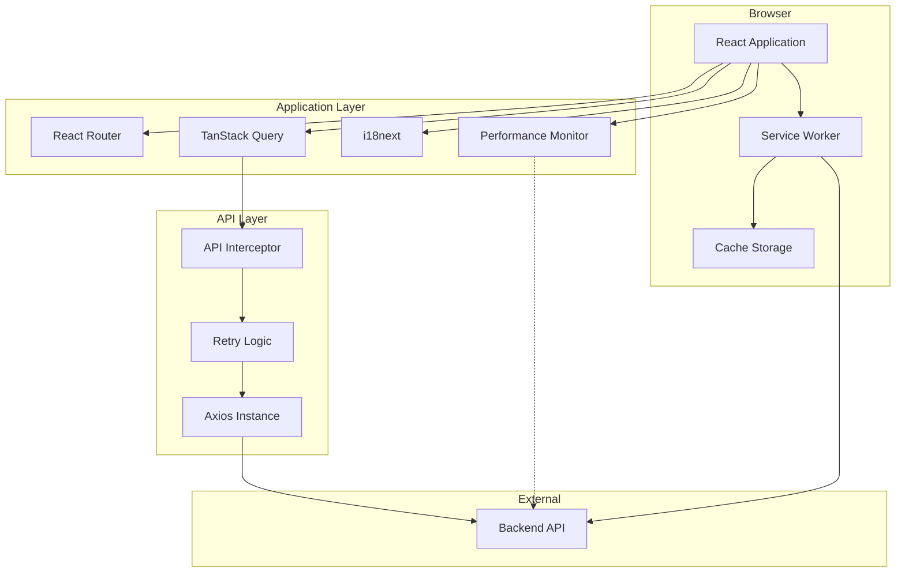
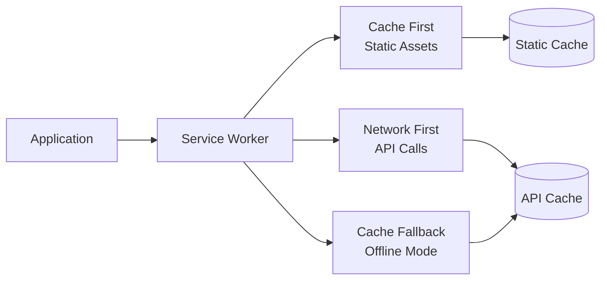

# Design Document: Web Application Enhancements

## Overview

This design document outlines comprehensive enhancements to the React-based competition management web application to improve production readiness, developer experience, and architecture quality. The enhancements span 13 distinct areas including Progressive Web App capabilities, performance monitoring, security hardening, testing infrastructure, internationalization, and developer tooling.

### Goals

- Enable offline-first capabilities through PWA implementation
- Establish comprehensive performance and error monitoring
- Harden security posture with CSP and security headers
- Improve API reliability with retry logic and interceptors
- Modernize state management with TanStack Query
- Expand testing coverage with E2E and visual regression tests
- Support internationalization for English and Hindi
- Enhance developer experience with automated tooling
- Document design system components with Storybook
- Validate environment configuration at startup

### Non-Goals

- Backend API changes or enhancements
- Database schema modifications
- Authentication/authorization logic changes
- UI/UX redesign of existing features
- Mobile native app development

### Technology Stack

- **Frontend Framework**: React 19.1.1 with Vite 7.1.7
- **Testing**: Vitest 4.0.16, Playwright (E2E), vitest-axe
- **State Management**: TanStack Query v5
- **PWA**: Workbox 7
- **Performance**: web-vitals library
- **i18n**: react-i18next
- **Documentation**: Storybook 8
- **Code Quality**: Prettier, Husky, lint-staged
- **Validation**: Zod (already in dependencies)

## Architecture

### High-Level Architecture



### Component Architecture

The application follows a layered architecture:

1. **Presentation Layer**: React components, design system
2. **State Management Layer**: TanStack Query for server state, React Context for client state
3. **API Layer**: Enhanced axios instance with interceptors and retry logic
4. **Service Worker Layer**: Offline support and caching strategies
5. **Monitoring Layer**: Performance metrics and error tracking

### PWA Architecture



## Components and Interfaces

### 1. PWA Components

#### Service Worker (`public/sw.js`)
- **Responsibilities**: Asset caching, offline support, update notifications
- **Caching Strategies**:
  - Cache-first for static assets (JS, CSS, images, fonts)
  - Network-first with cache fallback for API requests
  - Runtime caching for navigation requests

#### Manifest (`public/manifest.json`)
- **Properties**: name, short_name, icons, theme_color, background_color, display, start_url, scope

#### PWA Registration (`src/utils/registerSW.js`)
- **Interface**:
  ```javascript
  export function registerServiceWorker(onUpdate: (registration) => void): void
  export function unregisterServiceWorker(): Promise<boolean>
  ```

### 2. Performance Monitoring Components

#### Web Vitals Reporter (`src/utils/webVitals.js`)
- **Interface**:
  ```javascript
  export function reportWebVitals(onPerfEntry?: (metric: Metric) => void): void
  ```
- **Metrics**: LCP, FID, CLS, TTFB, FCP
- **Reporting**: Console logging in development, can be extended to analytics service

#### Error Boundary Enhancement (`src/components/ErrorBoundary.jsx`)
- **Current**: Basic error catching
- **Enhancement**: Add error logging, user-friendly fallback UI, error context collection

### 3. Security Components

#### Security Headers Configuration (`vite.config.js` + `public/_headers`)
- **CSP Configuration**:
  ```
  Content-Security-Policy: 
    default-src 'self';
    script-src 'self' 'unsafe-inline';
    style-src 'self' 'unsafe-inline';
    img-src 'self' data: https:;
    font-src 'self' data:;
    connect-src 'self' ${API_URL};
    frame-ancestors 'none';
  ```
- **Additional Headers**: X-Content-Type-Options, X-Frame-Options, Referrer-Policy, Permissions-Policy

### 4. Enhanced API Layer

#### API Interceptor (`src/services/apiInterceptor.js`)
- **Interface**:
  ```javascript
  export function setupInterceptors(axiosInstance: AxiosInstance): void
  export function createRetryConfig(config: RetryConfig): RetryConfig
  ```
- **Features**:
  - Request timing metadata
  - Automatic retry with exponential backoff
  - Request cancellation support
  - Enhanced error logging

#### Retry Logic (`src/utils/retryLogic.js`)
- **Interface**:
  ```javascript
  export function shouldRetry(error: AxiosError): boolean
  export function getRetryDelay(retryCount: number): number
  export const MAX_RETRIES = 3
  ```

### 5. Server State Management

#### TanStack Query Setup (`src/utils/queryClient.js`)
- **Configuration**:
  ```javascript
  export const queryClient = new QueryClient({
    defaultOptions: {
      queries: {
        staleTime: 60000, // 1 minute
        cacheTime: 300000, // 5 minutes
        refetchOnWindowFocus: true,
        refetchOnReconnect: true,
        retry: 1
      }
    }
  })
  ```

#### Query Hooks (`src/hooks/queries/`)
- **Structure**:
  - `useTeamsQuery.js`
  - `usePlayersQuery.js`
  - `useScoresQuery.js`
  - `useProfileQuery.js`

#### Mutation Hooks (`src/hooks/mutations/`)
- **Structure**:
  - `useCreateTeamMutation.js`
  - `useUpdateScoreMutation.js`
  - `useLoginMutation.js`

### 6. E2E Testing Infrastructure

#### Playwright Configuration (`playwright.config.js`)
- **Browsers**: Chromium, Firefox, WebKit
- **Base URL**: http://localhost:5173
- **Features**: Screenshots on failure, HTML reports, trace collection

#### Test Structure (`tests/e2e/`)
- `auth.spec.js` - Login/registration flows
- `scoring.spec.js` - Score submission flows
- `teams.spec.js` - Team management flows
- `navigation.spec.js` - Navigation and routing

### 7. Internationalization

#### i18n Configuration (`src/i18n/config.js`)
- **Languages**: English (en), Hindi (hi)
- **Features**: Lazy loading, pluralization, date/number formatting
- **Storage**: localStorage for persistence

#### Translation Files (`src/i18n/locales/`)
- `en/translation.json`
- `hi/translation.json`

#### Language Selector Component (`src/components/LanguageSelector.jsx`)
- **Interface**:
  ```javascript
  export function LanguageSelector(): JSX.Element
  ```

### 8. Component Documentation

#### Storybook Configuration (`.storybook/`)
- **Addons**: a11y, controls, docs, viewport
- **Features**: Dark mode support, responsive preview, source code display

#### Story Structure (`src/components/design-system/**/*.stories.jsx`)
- Stories for all design system components
- Interactive controls for props
- Usage documentation

### 9. Accessibility Testing

#### vitest-axe Integration (`src/test/axe-setup.js`)
- **Configuration**: WCAG AA standards
- **Coverage**: All design system components, all page components

#### Accessibility Test Utilities (`src/test/a11y-utils.js`)
- **Interface**:
  ```javascript
  export async function testA11y(component: ReactElement): Promise<void>
  export async function testKeyboardNav(component: ReactElement): Promise<void>
  ```

### 10. Code Quality Automation

#### Husky Configuration (`.husky/`)
- `pre-commit` - Run lint-staged

#### lint-staged Configuration (`package.json`)
```json
{
  "lint-staged": {
    "*.{js,jsx}": ["eslint --fix", "prettier --write"],
    "*.{json,md,css}": ["prettier --write"]
  }
}
```

#### Prettier Configuration (`.prettierrc`)
```json
{
  "semi": true,
  "singleQuote": true,
  "tabWidth": 2,
  "trailingComma": "es5",
  "printWidth": 100
}
```

### 11. Environment Validation

#### Environment Schema (`src/config/envSchema.js`)
- **Interface**:
  ```javascript
  export const envSchema: z.ZodObject
  export function validateEnv(): ValidatedEnv
  ```
- **Validation**: Required variables, type checking, URL format validation

### 12. Bundle Analysis

#### Rollup Plugin Visualizer (`vite.config.js`)
- **Configuration**: Generate treemap visualization at `dist/stats.html`
- **Metrics**: Parsed size, gzipped size, module breakdown

### 13. Visual Regression Testing

#### Playwright Visual Testing (`tests/visual/`)
- **Viewports**: Mobile (375px), Tablet (768px), Desktop (1920px)
- **Pages**: Login, Dashboard, Scoring
- **Features**: Baseline management, diff generation, threshold configuration

## Data Models

### Performance Metric
```typescript
interface PerformanceMetric {
  name: 'LCP' | 'FID' | 'CLS' | 'TTFB' | 'FCP';
  value: number;
  rating: 'good' | 'needs-improvement' | 'poor';
  delta: number;
  id: string;
  timestamp: number;
}
```

### Error Log
```typescript
interface ErrorLog {
  message: string;
  stack?: string;
  componentStack?: string;
  timestamp: number;
  userAgent: string;
  url: string;
  userId?: string;
}
```

### Retry Configuration
```typescript
interface RetryConfig {
  maxRetries: number;
  retryDelay: number;
  retryCondition: (error: AxiosError) => boolean;
  onRetry?: (retryCount: number, error: AxiosError) => void;
}
```

### Translation Resource
```typescript
interface TranslationResource {
  [key: string]: string | TranslationResource;
}

interface I18nConfig {
  lng: string;
  fallbackLng: string;
  resources: {
    [language: string]: {
      translation: TranslationResource;
    };
  };
}
```

### Visual Regression Result
```typescript
interface VisualRegressionResult {
  testName: string;
  viewport: 'mobile' | 'tablet' | 'desktop';
  passed: boolean;
  diffPercentage?: number;
  baselineImage: string;
  currentImage: string;
  diffImage?: string;
}
```

## Error Handling

### Error Categories

1. **Network Errors**
   - Retry automatically up to 3 times
   - Show user-friendly message after all retries fail
   - Log error details for debugging

2. **Authentication Errors (401)**
   - Clear stored tokens
   - Redirect to appropriate login page
   - Preserve intended destination for post-login redirect

3. **Authorization Errors (403)**
   - Show permission denied message
   - Log error for security monitoring
   - Provide contact information for access requests

4. **Validation Errors (400)**
   - Display field-specific error messages
   - Highlight invalid fields
   - Do not retry

5. **Server Errors (5xx)**
   - Retry automatically
   - Show generic error message to user
   - Log full error details

6. **React Component Errors**
   - Catch with Error Boundary
   - Display fallback UI
   - Log error with component stack
   - Provide recovery action (reload page)

### Error Logging Strategy

```javascript
// Error log structure
{
  level: 'error' | 'warn' | 'info',
  category: 'network' | 'auth' | 'component' | 'validation',
  message: string,
  context: {
    url?: string,
    method?: string,
    statusCode?: number,
    component?: string,
    userId?: string
  },
  timestamp: number,
  stack?: string
}
```

## Testing Strategy

This feature encompasses infrastructure, configuration, and tooling enhancements rather than business logic with testable properties. The requirements focus on setup, integration, and configuration validation.

### Why Property-Based Testing Does Not Apply

Property-based testing is not appropriate for this feature because:

1. **Infrastructure as Code**: PWA setup, security headers, build configuration are declarative configurations, not functions with varying inputs
2. **Integration Testing Focus**: Most requirements validate that external tools (Workbox, Playwright, Storybook) are correctly integrated
3. **Configuration Validation**: Environment validation, CSP headers, and manifest files are one-time setup checks
4. **Tool Behavior Testing**: We're testing that third-party tools (TanStack Query, i18next, Husky) work as configured, not our own algorithmic logic
5. **Side-Effect Operations**: Service worker registration, performance metric reporting, and error logging are side-effect operations without meaningful return values to assert properties on

### Testing Approach

Instead of property-based tests, this feature requires:

#### 1. Integration Tests
- Verify service worker registration and caching behavior
- Test API interceptor retry logic with mock server
- Validate TanStack Query integration with mock API responses
- Test i18n language switching and translation loading

#### 2. E2E Tests (Playwright)
- Critical user flows: login, registration, scoring, team management
- Cross-browser compatibility (Chromium, Firefox, WebKit)
- Offline functionality testing
- Visual regression testing at multiple viewports

#### 3. Unit Tests
- Environment schema validation with valid/invalid inputs
- Retry logic decision functions (shouldRetry, getRetryDelay)
- Error boundary fallback rendering
- Language selector component behavior

#### 4. Accessibility Tests (vitest-axe)
- All design system components
- All page components
- Keyboard navigation
- Screen reader announcements

#### 5. Configuration Tests
- Validate manifest.json structure
- Verify security headers in build output
- Check Prettier/ESLint configuration
- Validate Storybook builds successfully

#### 6. Smoke Tests
- Application starts without errors
- Service worker registers successfully
- Environment variables load correctly
- All routes render without crashing

### Test Coverage Goals

- **Unit Tests**: 80% coverage for utility functions and hooks
- **Integration Tests**: All API interceptor scenarios, all TanStack Query hooks
- **E2E Tests**: All critical user flows (login, registration, scoring, team management)
- **Accessibility Tests**: 100% of design system components, 100% of page components
- **Visual Regression**: Login, dashboard, and scoring pages at 3 viewports

### Test Execution Strategy

```json
{
  "scripts": {
    "test": "vitest",
    "test:unit": "vitest run",
    "test:e2e": "playwright test",
    "test:e2e:ui": "playwright test --ui",
    "test:visual": "playwright test tests/visual",
    "test:a11y": "vitest run --grep a11y",
    "test:ci": "npm run test:unit && npm run test:e2e && npm run test:visual"
  }
}
```

### Continuous Integration

- Run unit tests on every commit
- Run E2E tests on pull requests
- Run visual regression tests on pull requests
- Update visual baselines only after manual review
- Fail builds on critical accessibility violations

## Implementation Approach

### Phase 1: Foundation (PWA, Performance, Security)

1. **PWA Setup**
   - Install Workbox and vite-plugin-pwa
   - Create manifest.json with app metadata and icons
   - Configure service worker with caching strategies
   - Implement SW registration and update notification
   - Test offline functionality

2. **Performance Monitoring**
   - Install web-vitals library
   - Create webVitals.js reporter
   - Integrate with main.jsx
   - Enhance ErrorBoundary with logging
   - Test metric collection

3. **Security Headers**
   - Create _headers file for Render deployment
   - Configure CSP in vite.config.js for development
   - Test headers in production build
   - Validate CSP doesn't break existing functionality

### Phase 2: API and State Management

4. **API Layer Enhancement**
   - Create apiInterceptor.js with retry logic
   - Implement request timing metadata
   - Add request cancellation support
   - Enhance error logging
   - Test retry scenarios with mock server

5. **TanStack Query Integration**
   - Install @tanstack/react-query
   - Create queryClient.js configuration
   - Wrap App with QueryClientProvider
   - Create query hooks for existing API calls
   - Create mutation hooks with optimistic updates
   - Migrate existing API calls incrementally

### Phase 3: Testing Infrastructure

6. **E2E Testing Setup**
   - Install Playwright
   - Create playwright.config.js
   - Write test specs for critical flows
   - Configure CI pipeline integration
   - Set up screenshot and trace collection

7. **Accessibility Testing Expansion**
   - Ensure vitest-axe is configured
   - Write a11y tests for all design system components
   - Write a11y tests for all page components
   - Add keyboard navigation tests
   - Configure build to fail on critical violations

8. **Visual Regression Testing**
   - Configure Playwright for visual testing
   - Capture baseline screenshots
   - Write visual tests for critical pages
   - Set up diff threshold configuration
   - Document baseline update process

### Phase 4: Developer Experience

9. **Internationalization**
   - Install react-i18next and i18next
   - Create i18n configuration
   - Create translation files for English and Hindi
   - Implement LanguageSelector component
   - Wrap App with I18nextProvider
   - Migrate hardcoded strings incrementally

10. **Storybook Setup**
    - Install Storybook and addons
    - Configure .storybook/main.js and preview.js
    - Write stories for design system components
    - Add usage documentation
    - Configure static build for deployment

11. **Code Quality Automation**
    - Install Husky, lint-staged, and Prettier
    - Create .prettierrc configuration
    - Configure lint-staged in package.json
    - Set up pre-commit hook
    - Run Prettier on entire codebase

12. **Environment Validation**
    - Create envSchema.js with Zod schema
    - Define required and optional variables
    - Implement validateEnv function
    - Call validation in main.jsx
    - Document required environment variables

13. **Bundle Analysis**
    - Install rollup-plugin-visualizer
    - Configure in vite.config.js
    - Generate initial report
    - Identify optimization opportunities
    - Document bundle analysis process

### Migration Strategy

- **Incremental Adoption**: Migrate to TanStack Query and i18n incrementally, one feature at a time
- **Backward Compatibility**: Maintain existing API calls during migration
- **Feature Flags**: Use environment variables to enable/disable new features during rollout
- **Testing**: Test each enhancement independently before moving to next phase
- **Documentation**: Update README and developer docs as each phase completes

### Rollback Plan

- Each enhancement is independent and can be disabled/removed without affecting others
- Service worker can be unregistered if issues arise
- TanStack Query can coexist with existing API calls
- i18n can be disabled by not wrapping with I18nextProvider
- Pre-commit hooks can be bypassed with --no-verify flag

## Dependencies

### New Dependencies

```json
{
  "dependencies": {
    "@tanstack/react-query": "^5.0.0",
    "react-i18next": "^14.0.0",
    "i18next": "^23.0.0",
    "i18next-browser-languagedetector": "^7.0.0",
    "i18next-http-backend": "^2.0.0",
    "web-vitals": "^3.5.0",
    "workbox-window": "^7.0.0"
  },
  "devDependencies": {
    "@playwright/test": "^1.40.0",
    "@storybook/react": "^8.0.0",
    "@storybook/react-vite": "^8.0.0",
    "@storybook/addon-essentials": "^8.0.0",
    "@storybook/addon-a11y": "^8.0.0",
    "husky": "^9.0.0",
    "lint-staged": "^15.0.0",
    "prettier": "^3.0.0",
    "rollup-plugin-visualizer": "^5.12.0",
    "vite-plugin-pwa": "^0.19.0",
    "workbox-core": "^7.0.0",
    "workbox-precaching": "^7.0.0",
    "workbox-routing": "^7.0.0",
    "workbox-strategies": "^7.0.0"
  }
}
```

### Existing Dependencies (No Changes)

- React, React DOM, React Router
- Axios (enhanced with interceptors)
- Zod (used for environment validation)
- Vitest, vitest-axe (expanded usage)
- ESLint (integrated with pre-commit hooks)

## Deployment Considerations

### Build Process

1. Run Prettier and ESLint via pre-commit hooks
2. Run unit tests
3. Build application with Vite
4. Generate service worker with Workbox
5. Generate bundle analysis report
6. Run E2E tests against production build
7. Run visual regression tests
8. Deploy to Render with _headers file

### Environment Variables

Required variables (validated at startup):
- `VITE_API_URL` - Backend API URL
- `VITE_ENABLE_PWA` - Enable/disable PWA features (default: true)
- `VITE_ENABLE_I18N` - Enable/disable internationalization (default: true)

Optional variables:
- `VITE_ANALYTICS_ID` - Analytics service ID for performance metrics
- `VITE_SENTRY_DSN` - Sentry DSN for error tracking

### Performance Impact

- **Initial Bundle Size**: +150KB (TanStack Query, i18next, web-vitals)
- **Service Worker**: +50KB (Workbox runtime)
- **Lazy Loading**: Translation files loaded on demand
- **Caching**: Improved subsequent load times with SW caching

### Browser Support

- **Modern Browsers**: Full support (Chrome, Firefox, Safari, Edge)
- **Service Worker**: Graceful degradation for browsers without SW support
- **PWA Installation**: Available on supported browsers/platforms
- **i18n**: Works in all browsers

### Monitoring and Observability

- Web Vitals metrics logged to console (can be sent to analytics)
- Error Boundary logs to console (can be sent to error tracking service)
- API interceptor logs request/response timing
- Service worker logs cache hits/misses in development

## Security Considerations

### Content Security Policy

- Restrict script sources to self and trusted CDNs
- Prevent inline script execution (except with nonces)
- Block frame embedding to prevent clickjacking
- Restrict connect-src to backend API only

### Service Worker Security

- Serve SW over HTTPS only
- Validate cached responses before serving
- Implement cache versioning to prevent stale data
- Clear caches on SW update

### API Security

- Maintain existing token-based authentication
- Add request timing to detect slow loris attacks
- Log failed requests for security monitoring
- Implement request cancellation to prevent resource exhaustion

### Environment Variable Security

- Never commit .env files
- Validate all environment variables at startup
- Use VITE_ prefix for client-side variables only
- Document which variables are safe for client exposure

## Accessibility Considerations

### WCAG AA Compliance

- All components tested with vitest-axe
- Color contrast ratios validated
- Keyboard navigation tested
- Screen reader announcements verified

### Internationalization Accessibility

- Language selector keyboard accessible
- Language changes announced to screen readers
- RTL support prepared (for future languages)
- Date/number formatting respects locale

### Error Handling Accessibility

- Error messages announced to screen readers
- Error Boundary fallback UI keyboard accessible
- Focus management in error states
- Clear error recovery instructions

## Future Enhancements

### Phase 5 (Future)

- **Analytics Integration**: Send Web Vitals to analytics service
- **Error Tracking**: Integrate Sentry or similar service
- **Push Notifications**: Implement push notifications for score updates
- **Background Sync**: Sync data when connection restored
- **Advanced Caching**: Implement more sophisticated caching strategies
- **Performance Budgets**: Enforce bundle size limits in CI
- **Additional Languages**: Add more language support beyond English and Hindi
- **Advanced A11y**: Implement advanced accessibility features (voice control, etc.)

---

**Document Version**: 1.0  
**Last Updated**: 2025-01-XX  
**Status**: Ready for Review

