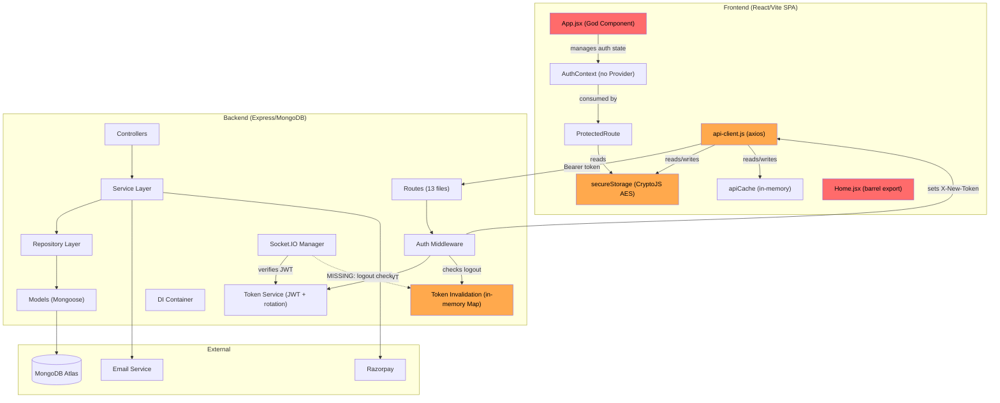

# Mallakhamb India Platform — Unified Engineering Audit & Action Plan

---

## 1. Executive Summary

The Mallakhamb India platform is a competition management system comprising a **React 18/Vite SPA** frontend and a **Node.js/Express/MongoDB** backend with Socket.IO real-time capabilities and Razorpay payment integration. Both layers show evidence of intentional, above-average architectural decisions — the backend has a deliberate DI/repository/service pattern; the frontend has a design token system, CSP, sanitization, and lazy-loading.

However, deep cross-layer analysis reveals **6 systemic issues** that neither individual review fully captured in isolation:

| # | Systemic Issue | Business Risk |
|---|----------------|---------------|
| **S1** | Token lifecycle mismatch — backend rotates tokens via `X-New-Token` header, **frontend never reads it** | Silent auth failures after 12h, eventual session drops |
| **S2** | Role naming split — frontend uses `superadmin`, backend model uses `super_admin`, middleware hedges both | Authorization bypass potential, silent permission failures |
| **S3** | Security theater chain — client-side "encryption" + no token expiry check in ProtectedRoute + `window.location.href` hard redirects | XSS token theft, infinite spinners, lost form data |
| **S4** | Admin registration wide open — `POST /api/admin/register` is public, no auth required | Full platform takeover by anonymous users |
| **S5** | OTP predictability + non-atomic verification | Account takeover via password reset |
| **S6** | Credentials committed to git history | All infrastructure compromised if repo accessed |

**Overall platform maturity: 5.4/10** — solid foundations but critical security gaps and architectural inconsistencies prevent production readiness.

---

## 2. Unified System Analysis

### 2.1 Architecture Overview



> [!WARNING]
> Red nodes = critical issues. Orange nodes = high-priority issues.

### 2.2 Cross-Layer Interaction Patterns

| Interaction | Frontend | Backend | Status |
|-------------|----------|---------|--------|
| Authentication | `api-client.js` sends `Bearer` token | `auth.middleware.js` verifies JWT | ✅ Working |
| Token rotation | **Not implemented** — `X-New-Token` header ignored | `auth.middleware.js:149` sets header via `tokenService.rotateTokenIfNeeded()` | ❌ **Broken** |
| Token storage | `secureStorage` (AES in localStorage) | Stateless JWT | ⚠️ Security theater |
| Role resolution | URL path → role string (`superadmin`) | Token `userType` + model `role` field (`super_admin`) | ❌ **Mismatch** |
| Token expiry (client) | `api-client.js:54` checks expiry, `ProtectedRoute` does NOT | Backend rejects expired tokens | ⚠️ Inconsistent |
| Logout | Clears ALL storage (`localStorage.clear()`) | Records logout timestamp in in-memory Map | ⚠️ Data loss + volatile |
| Competition context | Extracted from JWT via `getCompetitionIdFromToken()` | Embedded in JWT payload by `setCompetitionContext()` | ✅ Working |
| Socket auth | N/A (no `socket.io-client` usage found) | Socket.IO middleware verifies JWT but skips logout check | ⚠️ Unused + incomplete |
| Error handling | `error-handler.js` has broken import path | Centralized `error.middleware.js` — excellent | ⚠️ Frontend broken |
| Rate limiting | `useRateLimit` (client-side, bypassable via refresh) | `express-rate-limit` on auth endpoints | ✅ Backend solid |
| Input validation | Zod schemas for forms | express-validator + mongo-sanitize | ✅ Both solid |
| CSRF | N/A (uses Bearer tokens) | CSRF middleware exists but JWT clients are exempt | ✅ Correct design |

### 2.3 Detected Architectural Patterns

| Pattern | Frontend | Backend | Assessment |
|---------|----------|---------|------------|
| **Layered architecture** | Partial (pages → hooks → services → utils) | Strong (routes → controllers → services → repos → models) | Backend stronger |
| **DI / IoC** | None | Custom DI container with circular dep detection | Good but manual wiring |
| **Repository pattern** | N/A | Yes, with base class (soft delete, lean, password-aware) | Well implemented |
| **Error hierarchy** | Flat (single error-handler.js) | Rich (`BaseError` → 5 subtypes with `isOperational`) | Backend excellent |
| **Design tokens** | `DESIGN_TOKENS` system with deprecation proxy | N/A | Frontend excellent |
| **Code splitting** | Lazy loading all pages | N/A | Defeated by Home.jsx barrel |
| **State management** | React Context (no external state lib) | N/A | Minimal but functional |
| **Caching** | `apiCache` (whitelist-only, TTL) | N/A | Clever but hacky implementation |

---

## 3. Cross-Stack Risk Analysis

### 3.1 🔴 CRITICAL — Active Exploits or Data Loss Risks

---

#### CRIT-1: Admin Registration Publicly Accessible

| Dimension | Detail |
|-----------|--------|
| **Problem** | `POST /api/admin/register` has no auth middleware — anyone can create admin accounts |
| **Root cause** | Route defined without `authMiddleware` + `requireSuperAdmin` guards |
| **Frontend impact** | None directly, but a rogue admin can manipulate all data the frontend displays |
| **Backend impact** | Complete privilege escalation — score manipulation, team approvals, financial data |
| **Risk level** | 🔴 **CRITICAL** — trivially exploitable with a single curl command |
| **Solution** | Add `authMiddleware, requireSuperAdmin` to the route, or remove the endpoint entirely (use CLI `createAdmin.js` script) |
| **Complexity** | Trivial (15 minutes) |
| **Payoff** | Closes the single highest-impact exploit vector |

---

#### CRIT-2: OTP Generated with `Math.random()` + Non-Atomic Verification

| Dimension | Detail |
|-----------|--------|
| **Problem** | OTP codes use `Math.random()` (predictable). Verification is non-atomic — `verifyOTP` and `updateById` are separate operations, allowing parallel replay. |
| **Root cause** | `crypto.randomInt()` already imported but unused. Verify-then-update is a TOCTOU race. |
| **Frontend impact** | Users could have their accounts taken over via password reset |
| **Backend impact** | Account takeover, potential score/payment manipulation |
| **Risk level** | 🔴 **CRITICAL** — exploitable by anyone who can trigger a password reset |
| **Solution** | 1. Replace `Math.random()` with `crypto.randomInt(min, max)`. 2. Use `findOneAndUpdate` with OTP as query condition for atomic single-use. 3. Call `otpService.clearOTP()` after successful reset (currently skipped, leaving the OTP record in-database after reset). |
| **Complexity** | Low (30 minutes) |
| **Payoff** | Eliminates account takeover via password reset |

---

#### CRIT-3: ProtectedRoute Never Validates Token Expiry → Infinite Spinner

| Dimension | Detail |
|-----------|--------|
| **Problem** | [protected-route.jsx](file:///d:/Mallakhamb-Repo/Mallakhamb-server-refactor/Web/src/middleware/protected-route.jsx) checks if a token *exists* in `secureStorage` but never calls `isTokenExpired()`. An expired token + stored user data = infinite loading spinner. |
| **Root cause** | `isTokenExpired` is used in `api-client.js` interceptor but not in route guards |
| **Frontend impact** | Users stuck on spinners indefinitely. Auth state is limbo — appears authenticated to storage but null in context. |
| **Backend impact** | None directly — backend rejects expired tokens — but the frontend never makes the request to find out |
| **Risk level** | 🔴 **CRITICAL** (UX impact, not security) — affects every user whose token expires during a session |
| **Solution** | Import `isTokenExpired` into ProtectedRoute. If token is expired, clear storage and redirect to login. |
| **Complexity** | Trivial (30 minutes) |
| **Payoff** | Eliminates the most common user-facing bug |

---

### 3.2 🟠 HIGH — Architectural Damage or Security Weakening

---

#### HIGH-1: Token Rotation Completely Broken Across the Stack

| Dimension | Detail |
|-----------|--------|
| **Problem** | Backend's `auth.middleware.js:148-155` sets `X-New-Token` response header when tokens are > 12h old. The frontend's `api-client.js` **never reads this header** — zero references to `X-New-Token` in the entire frontend codebase. |
| **Root cause** | Backend feature implemented without corresponding frontend work |
| **Frontend impact** | Tokens are never rotated. After 24h, the token expires and the user gets a hard redirect (`window.location.href = '/'`) — losing all React state and form data |
| **Backend impact** | Token rotation logic runs but has no effect — wasted computation |
| **Risk level** | 🟠 **HIGH** — forces 24h session hard-cut with data loss |
| **Solution** | Add response interceptor in `api-client.js` to capture `X-New-Token` and update `secureStorage`. **This is a coordinated cross-stack fix.** |
| **Complexity** | Low (1 hour for frontend interceptor) |
| **Payoff** | Seamless long sessions without data loss |

**Implementation:**
```javascript
// api-client.js — add to response interceptor
api.interceptors.response.use(
  (response) => {
    // Handle token rotation from backend
    const newToken = response.headers['x-new-token'];
    if (newToken) {
      const currentType = getCurrentUserTypeFromURL();
      if (currentType) {
        secureStorage.setItem(`${currentType}_token`, newToken);
      }
    }
    // ... existing cache logic ...
    return response;
  },
  // ... existing error handler ...
);
```

---

#### HIGH-2: Role Naming Inconsistency — `superadmin` vs `super_admin` Full Stack Split

| Dimension | Detail |
|-----------|--------|
| **Problem** | Frontend uses `'superadmin'` everywhere (URL paths, storage keys, API routes). Backend Admin model enum uses `['admin', 'super_admin']`. Auth middleware hedges with `requireRole('admin', 'superadmin', 'super_admin')`. Token `userType` could be either. |
| **Root cause** | No shared contract/schema between frontend and backend role definitions |
| **Frontend impact** | `api-client.js:117` checks `decoded.role === 'superadmin'` — this will NEVER match if the token was issued with `userType: 'super_admin'`. Super admins get incorrectly redirected on 403 errors. |
| **Backend impact** | Auth middleware has to check 3 values instead of 1. Dual route mounts (`/api/super-admin` AND `/api/superadmin`) double the attack surface. |
| **Risk level** | 🟠 **HIGH** — can cause silent authorization failures |
| **Solution** | Standardize on ONE value across the entire platform. Since the backend model uses `super_admin`, adopt that. OR since the frontend URLs use `superadmin`, change the model. **Pick one and migrate everything.** |
| **Complexity** | Medium (2–3 hours, requires coordinated search-and-replace across both stacks) |
| **Payoff** | Eliminates an entire class of auth bugs |

---

#### HIGH-3: `secureStorage` Encryption Is Security Theater

| Dimension | Detail |
|-----------|--------|
| **Problem** | AES encryption key is `VITE_STORAGE_KEY` (embedded in JS bundle) + browser fingerprint (deterministic). Any user can extract both from DevTools. |
| **Root cause** | Misunderstanding of client-side encryption boundaries |
| **Frontend impact** | False sense of security. Developers may skip real token protection measures because "tokens are encrypted." |
| **Backend impact** | None — backend doesn't know about this encryption |
| **Risk level** | 🟠 **HIGH** — not because it's exploitable (XSS is the real threat), but because it creates a false security narrative |
| **Solution** | **Long-term:** Move tokens to `httpOnly` cookies set by the server (requires backend changes). **Short-term:** Rename to `obfuscatedStorage`, document it's NOT a security boundary, and invest energy in CSP hardening instead. |
| **Complexity** | Short-term: Trivial (rename + docs). Long-term: High (server cookie flow, CORS changes, CSRF implications) |
| **Payoff** | Eliminates entire class of XSS token theft (with httpOnly approach) |

---

#### HIGH-4: Home.jsx Used as Module Barrel — Defeats Code Splitting

| Dimension | Detail |
|-----------|--------|
| **Problem** | 13+ files import `COLORS`, `useReducedMotion`, `FadeIn`, `GlassCard`, etc. from `@/pages/public/Home`. A page component is being used as a shared utility barrel. |
| **Root cause** | Organic growth — utilities were initially defined where they were first needed |
| **Frontend impact** | Home.jsx is lazy-loaded, but importing from it eagerly in Navbar, Dropdown, ConfirmDialog forces the entire Home bundle to load on every route. Circular dependency risk. |
| **Backend impact** | None |
| **Risk level** | 🟠 **HIGH** — performance regression, bundle size inflation, architectural violation |
| **Solution** | Extract to proper locations: `COLORS` → `styles/tokens.js`, `useReducedMotion` → `hooks/useResponsive.js`, UI primitives → `components/design-system/` |
| **Complexity** | Medium (4 hours — 13 files to update) |
| **Payoff** | Proper code splitting, eliminates circular dep risk, cleaner architecture |

---

#### HIGH-5: In-Memory Token Invalidation Won't Survive Restarts

| Dimension | Detail |
|-----------|--------|
| **Problem** | Token invalidation uses `Map()` objects in [token-invalidation.util.js](file:///d:/Mallakhamb-Repo/Mallakhamb-server-refactor/Server/src/utils/security/token-invalidation.util.js). Server restart = all previously logged-out tokens become valid again. |
| **Root cause** | Acknowledged in code comments ("replace with Redis") — intentional tech debt |
| **Frontend impact** | Users who logged out may find their sessions still active after a server restart |
| **Backend impact** | Multi-instance deployments (Render auto-scaling) = per-instance invalidation only |
| **Risk level** | 🟠 **HIGH** — amplifies with scale |
| **Solution** | Short-term: Reduce JWT expiry to 1h (from 24h). Long-term: Redis-backed invalidation or short-lived access token + refresh token rotation. |
| **Complexity** | Short-term: Trivial. Long-term: 3–5 days. |
| **Payoff** | Proper logout semantics at scale |

---

#### HIGH-6: `window.location.href` Redirects Destroy React State

| Dimension | Detail |
|-----------|--------|
| **Problem** | [api-client.js](file:///d:/Mallakhamb-Repo/Mallakhamb-server-refactor/Web/src/services/api-client.js) uses `window.location.href = '/'` on 401/expired tokens (lines 62, 103, 125). This causes a full page reload. |
| **Root cause** | `api-client.js` is outside React's component tree and has no access to React Router's `navigate()` |
| **Frontend impact** | Full page reload destroys React state, re-downloads all chunks, loses unsaved form data. Bypasses the safe redirect utility. |
| **Backend impact** | None |
| **Risk level** | 🟠 **HIGH** (UX) — users filling out long forms lose everything on token expiry |
| **Solution** | Use event emitter pattern: `api-client.js` dispatches `auth:expired` event, `App.jsx` listens and navigates via React Router |
| **Complexity** | Low (3 hours) |
| **Payoff** | No more data loss on auth failures |

---

### 3.3 🟡 MEDIUM — Maintainability, Consistency, Defense-in-Depth

| ID | Issue | Stack | Root Cause | Impact |
|----|-------|-------|------------|--------|
| MED-1 | `getCurrentUserTypeFromURL()` duplicated in 3 frontend files | FE | No shared utility | New role = 3 places to update, ordering bug risk |
| MED-2 | Auth logic lives in `App.jsx` (216 lines), no `AuthProvider` | FE | Organic growth | Untestable auth, 3 redundant `useEffect` calls to `loadAuthData()` |
| MED-3 | `secureStorage.clear()` nukes ALL localStorage (kills other role sessions) | FE | `localStorage.clear()` is too aggressive | Multi-role logout destroys all sessions |
| MED-4 | Controller directly imports Model, bypasses service layer (`admin.controller.js:229`) | BE | Quick fix that stuck | Breaks layered architecture, no audit trail |
| MED-5 | Duplicate CORS config in `server.js` (inline) vs `security.middleware.js` (abstracted) | BE | Refactored middleware exists but isn't wired in | Confusing, changes to one don't affect the other |
| MED-6 | `console.log` in production code (server.js, admin.controller.js) | BE | Winston logger exists but not used consistently | Bypasses log levels, rotation, structured logging |
| MED-7 | Socket.IO auth doesn't check token invalidation (logout) | BE | Oversight in socket middleware | Logged-out users maintain WebSocket connections |
| MED-8 | Judge model has no `comparePassword` method | BE | Inconsistency across models | Auth service fallback works but is fragile |
| MED-9 | Password reset doesn't validate password strength | BE | Controller passes `req.body.password` directly | Users can set weak passwords |
| MED-10 | API cache uses `Promise.reject` hack for cache hits | FE | Clever but fragile pattern | Breaks error interceptors, confuses error tracking |
| MED-11 | `useApiCall` hook doesn't return `loading`/`error` state (JSDoc lies) | FE | Incomplete implementation | Every consumer manages its own loading state |
| MED-12 | `test-token` bypass in auth middleware could leak to production | BE | Only guarded by `NODE_ENV === 'test'` | If NODE_ENV misconfigured, all endpoints are open |
| MED-13 | `getRepositoryByType()` duplicated in auth service and OTP service, OTP version missing `judge` | BE | Copy-paste without shared utility | Adding a user type = update N places, some might miss it |
| MED-14 | `authentication.service.js` relies on `base.repository.js` detecting a `password` field to use `.save()` and trigger the pre-save hashing hook in `updateById`; if any repo overrides `updateById` or a new model adds a password field without this pattern, passwords are stored in plaintext | BE | Implicit contract between service layer and base repo | Wide blast radius — fragile correctness guarantee with no enforcement mechanism |
| MED-15 | Vite dev server has `allowedHosts: 'all'` combined with `host: '0.0.0.0'` — makes dev server accessible to any network device, vulnerable to DNS rebinding | FE | Dev convenience setting never restricted | Dev credentials or API responses exposed on shared networks |

---

### 3.4 🟢 LOW — Code Quality, DX, Polish

| ID | Issue | Stack |
|----|-------|-------|
| LOW-1 | `no-unused-vars` ESLint rule disabled | FE |
| LOW-2 | `void motion` pattern in 3 files (workaround for disabled lint rule) | FE |
| LOW-3 | CSP meta tag has `unsafe-inline` and `unsafe-eval` | FE |
| LOW-4 | `index.css` has light-theme defaults but app is dark (FOIT flash) | FE |
| LOW-5 | `socket.io-client` dependency installed but unused | FE |
| LOW-6 | `RouteContext.Provider` wrapped inline in route definitions (8x repetition) | FE |
| LOW-7 | Redundant route aliases (`/api/superadmin` AND `/api/super-admin`) | BE |
| LOW-8 | DI container exported as module-level singleton (harder to test) | BE |
| LOW-9 | Email send failure silently swallowed in OTP flow | BE |
| LOW-10 | `useAgeGroups` hook has extensive code duplication | FE |
| LOW-11 | `error-handler.js` has broken import path | FE |
| LOW-12 | Duplicate loading spinner JSX in ProtectedRoute (3 identical copies) | FE |
| LOW-13 | `Navbar.jsx:42-44` directly calls `localStorage.removeItem` for legacy keys inside its own `handleLogout` — which already calls `onLogout(navigate)` that handles cleanup in `App.jsx`; double cleanup means two-place maintenance | FE |
| LOW-14 | `initializeSocketIO` mutates 5 already-resolved DI container singletons by assigning `.socketManager` post-resolution — a code smell; singletons should be immutable after the container resolves them | BE |
| LOW-15 | Inline `require()` calls inside methods (`authentication.service.js:134`, `admin.controller.js:229`) — performance anti-pattern and obscures the module's dependency surface | BE |

---

## 4. Security Action Plan

### 4.1 Immediate (Do Today)

| Priority | Action | Files | Effort |
|----------|--------|-------|--------|
| P0 | **Rotate ALL credentials** — MongoDB, JWT secret, Razorpay, Gmail, Resend, ngrok | All infra | 1h |
| P0 | **Scrub git history** — `git rm --cached Server/.env Web/.env` then BFG | Git | 30m |
| P0 | **Protect admin registration** — add `authMiddleware, requireSuperAdmin` | [admin.routes.js](file:///d:/Mallakhamb-Repo/Mallakhamb-server-refactor/Server/src/routes/admin.routes.js) | 15m |
| P0 | **Replace `Math.random()`** with `crypto.randomInt()` in OTP generation | [otp.service.js](file:///d:/Mallakhamb-Repo/Mallakhamb-server-refactor/Server/src/services/auth/otp.service.js) | 10m |
| P0 | **Add token expiry check** to ProtectedRoute | [protected-route.jsx](file:///d:/Mallakhamb-Repo/Mallakhamb-server-refactor/Web/src/middleware/protected-route.jsx) | 30m |
| P1 | **Make OTP verification atomic** — use `findOneAndUpdate` | [authentication.service.js](file:///d:/Mallakhamb-Repo/Mallakhamb-server-refactor/Server/src/services/auth/authentication.service.js) | 30m |

### 4.2 This Week

| Priority | Action | Files | Effort |
|----------|--------|-------|--------|
| P1 | Add `comparePassword` to Judge model | [Judge.js](file:///d:/Mallakhamb-Repo/Mallakhamb-server-refactor/Server/models/Judge.js) | 5m |
| P1 | Add token invalidation check to Socket.IO auth | [socket.manager.js](file:///d:/Mallakhamb-Repo/Mallakhamb-server-refactor/Server/src/socket/socket.manager.js) | 10m |
| P1 | Strengthen test-token bypass guard | [auth.middleware.js](file:///d:/Mallakhamb-Repo/Mallakhamb-server-refactor/Server/src/middleware/auth.middleware.js) | 5m |
| P1 | Add password strength validation to reset flow | [authentication.service.js](file:///d:/Mallakhamb-Repo/Mallakhamb-server-refactor/Server/src/services/auth/authentication.service.js) | 30m |
| P2 | Restrict Vite dev server `allowedHosts` | [vite.config.js](file:///d:/Mallakhamb-Repo/Mallakhamb-server-refactor/Web/vite.config.js) | 5m |

### 4.3 This Month

| Priority | Action | Effort |
|----------|--------|--------|
| P2 | Move tokens to `httpOnly` cookies (coordinated FE+BE change) | 3–5d |
| P2 | Implement short-lived access tokens (15min) + refresh token rotation | 3–5d |
| P2 | Remove `unsafe-inline`/`unsafe-eval` from CSP, use nonce-based CSP with Vite plugin | 1d |
| P3 | Implement Redis-backed token invalidation | 1–2d |

---

## 5. Architecture Refactor Plan

### 5.1 Frontend Architecture Fixes

#### A. Extract AuthProvider from App.jsx (Priority: HIGH, Effort: 3h)

**Current:** [App.jsx](file:///d:/Mallakhamb-Repo/Mallakhamb-server-refactor/Web/src/App.jsx) is 216 lines mixing auth logic, URL detection, navbar visibility, and layout logic. Three `useEffect` hooks all call `loadAuthData()` redundantly.

**Target:**
```
src/contexts/AuthProvider.jsx     ← All auth state + logic
src/App.jsx                       ← Thin layout shell (~50 lines)
```

#### B. Dismantle Home.jsx Barrel (Priority: HIGH, Effort: 4h)

**Current:** 13+ files import shared utilities from `@/pages/public/Home`

**Target:**
```
src/styles/tokens.js              ← COLORS (already exists, make canonical)
src/hooks/useResponsive.js        ← useReducedMotion (already exists)
src/components/design-system/     ← FadeIn, GlassCard, GradientText, SaffronButton
src/pages/public/Home.jsx         ← Only default page export, no named exports
```

#### C. Centralize Role Resolution (Priority: HIGH, Effort: 1h)

**Current:** `getCurrentUserTypeFromURL()` duplicated in [App.jsx:20-28](file:///d:/Mallakhamb-Repo/Mallakhamb-server-refactor/Web/src/App.jsx#L20-L28), [api-client.js:21-29](file:///d:/Mallakhamb-Repo/Mallakhamb-server-refactor/Web/src/services/api-client.js#L21-L29), [protected-route.jsx:12-31](file:///d:/Mallakhamb-Repo/Mallakhamb-server-refactor/Web/src/middleware/protected-route.jsx#L12-L31)

**Target:**
```javascript
// src/utils/auth/roleFromPath.js
const ROLE_PREFIXES = [
  { prefix: '/superadmin', role: 'superadmin' },
  { prefix: '/admin', role: 'admin' },
  { prefix: '/coach', role: 'coach' },
  { prefix: '/player', role: 'player' },
  { prefix: '/judge', role: 'judge' },
];

export const getRoleFromPath = (pathname) => {
  const match = ROLE_PREFIXES.find(({ prefix }) => pathname.startsWith(prefix));
  return match?.role ?? null;
};
```

#### D. Fix Auth Redirect Flow (Priority: HIGH, Effort: 3h)

Replace `window.location.href` redirects with event-driven React Router navigation:

```javascript
// src/utils/auth/authEvents.js
export const authEvents = new EventTarget();
export const AUTH_EXPIRED = 'auth:expired';

// In api-client.js interceptor:
authEvents.dispatchEvent(new CustomEvent(AUTH_EXPIRED, { detail: { role: currentType } }));

// In AuthProvider, listen:
useEffect(() => {
  const handler = (e) => navigate(`/${e.detail.role}/login`);
  authEvents.addEventListener(AUTH_EXPIRED, handler);
  return () => authEvents.removeEventListener(AUTH_EXPIRED, handler);
}, []);
```

#### E. Implement Token Rotation Handler (Priority: HIGH, Effort: 1h)

```javascript
// api-client.js — response interceptor addition
const newToken = response.headers['x-new-token'];
if (newToken) {
  const currentType = getCurrentUserTypeFromURL();
  if (currentType) secureStorage.setItem(`${currentType}_token`, newToken);
}
```

### 5.2 Backend Architecture Fixes

#### A. Wire Abstracted Security Middleware (Priority: HIGH, Effort: 1h)

**Current:** [server.js:42-89](file:///d:/Mallakhamb-Repo/Mallakhamb-server-refactor/Server/server.js#L42-L89) has 47 lines of inline CORS config. The properly abstracted `createCorsMiddleware` in [security.middleware.js](file:///d:/Mallakhamb-Repo/Mallakhamb-server-refactor/Server/src/middleware/security.middleware.js) exists but isn't used.

**Target:** Replace server.js lines 42-89 with:
```javascript
const { createCorsMiddleware } = require('./src/middleware/security.middleware');
app.use(createCorsMiddleware(container));
```

#### B. Move unlockScores to Service Layer (Priority: MEDIUM, Effort: 30m)

[admin.controller.js:229](file:///d:/Mallakhamb-Repo/Mallakhamb-server-refactor/Server/src/controllers/admin.controller.js#L229) directly imports the Score model, bypassing the established layered architecture.

#### C. Extract UserRepositoryResolver (Priority: MEDIUM, Effort: 30m)

`getRepositoryByType` is duplicated in [authentication.service.js:581-594](file:///d:/Mallakhamb-Repo/Mallakhamb-server-refactor/Server/src/services/auth/authentication.service.js#L581-L594) and [otp.service.js:203-213](file:///d:/Mallakhamb-Repo/Mallakhamb-server-refactor/Server/src/services/auth/otp.service.js#L203-L213). The OTP version is missing `judge`.

#### D. Standardize Role Naming (Priority: HIGH, Effort: 2-3h)

**Decision required:** Choose either `superadmin` or `super_admin` and migrate all references:

| If choosing `superadmin` | If choosing `super_admin` |
|--------------------------|---------------------------|
| Change Admin model enum from `super_admin` to `superadmin` | Update all frontend routes, storage keys, API paths |
| Simpler — fewer changes | Matches MongoDB convention |
| Frontend stays as-is | Backend model stays as-is |
| **Recommended** | More work |

> [!IMPORTANT]
> This is a coordinated cross-stack change. Both stacks must be updated in the same release.

---

## 6. Performance & Scalability Plan

| Issue | Current State | Target State | Effort | Impact |
|-------|---------------|------------|--------|--------|
| Code splitting defeated by Home.jsx barrel | Every route loads Home.jsx eagerly | Proper tree-shaking, ~30-50% reduction in initial bundle | 4h | High |
| No bundle analysis | Unknown bundle composition | Run `npx vite-bundle-visualizer`, identify oversized chunks | 30m | Diagnostic |
| `AdminScoring.jsx` (42KB) and `AdminJudges.jsx` (41KB) | Monolithic page components | Component-level splitting with `React.lazy` for heavy sub-sections | 3h | Medium |
| Manual `apiCache` with Promise.reject hack | Fragile, breaks error interceptors | Replace with TanStack Query (react-query) | 2-3d | High |
| In-memory token invalidation | Per-instance, lost on restart | Redis-backed with TTL matching JWT expiry | 1-2d | High |
| No request deduplication (frontend) | Duplicate API calls on route transitions | TanStack Query handles this automatically | 2-3d | Medium |
| `socket.io-client` installed but unused | 65KB in node_modules, potential bundle leak | Remove or implement | 5m | Low |
| `secureStorage` encrypts/decrypts on every read/write | CPU overhead on every API call for theater | Remove encryption, use plain storage or httpOnly cookies | 1h or 3-5d | Low-Medium |

---

## 7. Developer Experience Improvements

| Issue | Improvement | Effort |
|-------|-------------|--------|
| `no-unused-vars: off` in ESLint | Enable as `warn` with `argsIgnorePattern: '^_'` | 2h |
| No TypeScript | Gradual migration starting from `services/`, `hooks/`, `utils/` | Ongoing |
| No tests whatsoever (either stack) | Add Vitest + React Testing Library (FE), Jest + Supertest (BE) | 3-5d initial |
| `bootstrap.js` is 310 lines of manual DI wiring | Group registrations by module, consider auto-registration | 1d |
| Error handler has broken import | Fix immediately — dead code or broken error handling | 5m |
| `index.css` light-theme flash (FOIT) | Set `color-scheme: dark`, `background-color: #0a0a0a` | 5m |
| 3 identical spinner copies in ProtectedRoute | Extract `AuthLoadingSpinner` component | 30m |
| `useApiCall` JSDoc is misleading | Add `loading`/`error` state management to hook | 1h |
| Inline `require()` in methods | Move all to top-of-file (now tracked as LOW-15) | 15m |
| `useAgeGroups` heavy duplication | Extract `getFilteredAgeGroups` shared function | 1h |

---

## 8. Recommended Folder/Module Restructuring

### 8.1 Frontend — Proposed Changes

```diff
 Web/src/
+ ├── components/design-system/       # NEW: FadeIn, GlassCard, GradientText, SaffronButton
  ├── components/layout/
  ├── components/auth/
  ├── components/responsive/
+ ├── contexts/AuthProvider.jsx        # NEW: Extracted from App.jsx
  ├── contexts/AuthContext.jsx         # Keep (just createContext + useAuth)
  ├── contexts/CompetitionContext.jsx
  ├── contexts/RouteContext.jsx
  ├── hooks/
+ ├── utils/auth/roleFromPath.js       # NEW: Shared getCurrentUserTypeFromURL
+ ├── utils/auth/authEvents.js         # NEW: Event emitter for auth state changes
  ├── utils/auth/secureStorage.js      # RENAME to obfuscatedStorage.js (or remove encryption)
  ├── utils/auth/tokenUtils.js
  ├── utils/auth/redirectUtils.js
  ├── services/api-client.js           # MODIFY: Add X-New-Token handler, event-based redirects
  ├── pages/public/Home.jsx            # MODIFY: Remove all named exports except default
  ├── middleware/protected-route.jsx   # MODIFY: Add isTokenExpired check
- ├── errors/error-handler.js          # FIX: Broken import path
  ├── App.jsx                          # SIMPLIFY: ~50 lines after AuthProvider extraction
```

### 8.2 Backend — Proposed Changes

```diff
 Server/
  ├── server.js                        # SLIM DOWN: Remove inline CORS (47 lines), use createCorsMiddleware
  ├── src/
  │   ├── config/
  │   ├── controllers/
  │   │   └── admin.controller.js      # FIX: Move unlockScores logic to service
  │   ├── errors/
  │   ├── infrastructure/
  │   │   ├── bootstrap.js             # REFACTOR: Group DI registrations by module
  │   │   └── di-container.js          # MODIFY: Export class, not singleton
  │   ├── middleware/
  │   │   ├── auth.middleware.js        # FIX: Standardize role naming
  │   │   └── security.middleware.js   # WIRE IN: Replace inline server.js CORS
  │   ├── repositories/
  │   ├── routes/
  │   │   └── admin.routes.js          # FIX: Add auth to registration endpoint
  │   │   └── index.js                 # FIX: Remove duplicate /api/superadmin mount
  │   ├── services/
  │   │   └── auth/
  │   │       ├── authentication.service.js  # FIX: Atomic OTP, password validation
  │   │       └── otp.service.js             # FIX: crypto.randomInt, add judge
  │   ├── socket/
  │   │   └── socket.manager.js        # FIX: Add token invalidation check
  │   │   # REFACTOR: initializeSocketIO currently mutates 5 resolved singletons
  │   │   # post-resolution (assigns .socketManager to them). Use lazy resolution
  │   │   # or event-based init so singletons remain immutable after DI registration
+ │   ├── utils/
+ │   │   └── user-repository-resolver.js  # NEW: Shared getRepositoryByType
  │   └── validators/
  └── models/
      └── Judge.js                     # FIX: Add comparePassword method
```

---

## 9. Architecture Maturity Assessment

| Dimension | Score | Justification |
|-----------|-------|---------------|
| **Security** | **3/10** | Three critical exploits (open admin registration, predictable OTP, committed credentials). Token handling has multiple gaps. No httpOnly cookies. CSP weakened with unsafe-inline/eval. |
| **Scalability** | **4/10** | In-memory token invalidation breaks multi-instance. No Redis. No message queue. 24h JWT with no refresh tokens. Manual cache management. |
| **Maintainability** | **6/10** | Good backend layering (DI/repo/service). Frontend has clear intentions but barrel export, duplicated functions, and god-component App.jsx hurt. |
| **Performance** | **5/10** | Lazy loading exists but defeated by Home.jsx barrel. API caching is clever but hacky. No bundle optimization analysis. Backend has compression and lean queries. |
| **Reliability** | **5/10** | Graceful shutdown is excellent. Error hierarchy is solid. But ProtectedRoute infinite spinner, hard redirects, and silent email failures reduce reliability. |
| **Observability** | **4/10** | Backend has Winston + metrics collector + correlation IDs. But `console.log` leaks bypass it. Frontend logger is dev-only. No APM/tracing. No alerting. |
| **Developer Experience** | **5/10** | Design token system is excellent. ESLint custom rules are great. But no TypeScript, no tests, disabled lint rules, manual DI wiring (310 lines), misleading JSDoc. |
| **Testability** | **2/10** | Zero tests in either stack. Auth logic in App.jsx is untestable without rendering the entire app. DI container is a module singleton. Test-token backdoor exists but no actual tests. |
| **Modularity** | **6/10** | Backend is well-modularized (DI container, repository pattern, service layer). Frontend has clear directory structure but Home.jsx barrel and App.jsx god-component break it. |
| **Production Readiness** | **3/10** | Critical security gaps. No tests. No CI/CD evidence. Committed credentials. In-memory state. console.log in production code. Dev-only CSP. |

**Overall: 4.3/10** — Strong foundations but not production-ready without addressing the critical and high-priority items.

---

## 10. Priority-Based Engineering Roadmap

### 🚨 Immediate Actions (1–3 days)

> [!CAUTION]
> These address active security exploits and user-facing bugs. Do not deploy without completing these.

| # | Task | Stack | Effort | Finding |
|---|------|-------|--------|---------|
| 1 | Rotate ALL credentials, scrub git history | Both | 1.5h | CRIT-1 |
| 2 | Protect admin registration with auth + superadmin check | BE | 15m | CRIT-2 |
| 3 | Replace `Math.random()` with `crypto.randomInt()` in OTP | BE | 10m | CRIT-3 |
| 4 | Make OTP verification atomic with `findOneAndUpdate` | BE | 30m | CRIT-3 |
| 5 | Add `isTokenExpired()` check to ProtectedRoute | FE | 30m | CRIT-4 |
| 6 | Add `comparePassword` to Judge model | BE | 5m | MED-8 |
| 7 | Add token invalidation check to Socket.IO auth | BE | 10m | MED-7 |
| 8 | Fix broken import in error-handler.js | FE | 5m | LOW-11 |
| 9 | Restrict `allowedHosts` in vite.config.js | FE | 5m | LOW — but free |
| 10 | Fix `index.css` color-scheme to dark | FE | 5m | LOW — but free |

---

### 📋 Short-Term Refactors (1–2 weeks)

> [!IMPORTANT]
> These stabilize the architecture and fix the cross-stack token lifecycle.

| # | Task | Stack | Effort | Finding |
|---|------|-------|--------|---------|
| 11 | **Implement `X-New-Token` handling** in api-client.js response interceptor | FE | 1h | HIGH-1 |
| 12 | **Standardize role naming** to one value across both stacks | Both | 2-3h | HIGH-2 |
| 13 | **Extract AuthProvider** from App.jsx | FE | 3h | MED-2 |
| 14 | **Dismantle Home.jsx barrel** — move to design-system/, tokens.js, hooks/ | FE | 4h | HIGH-4 |
| 15 | **Centralize `getCurrentUserTypeFromURL`** into shared utility | FE | 1h | MED-1 |
| 16 | **Replace `window.location.href` redirects** with event-driven navigation | FE | 3h | HIGH-6 |
| 17 | **Scope `secureStorage.clear()` to current role** | FE | 1h | MED-3 |
| 18 | **Consolidate CORS config** — wire security.middleware.js, remove server.js inline | BE | 1h | MED-5 |
| 19 | **Replace all `console.log`** with structured logger | BE | 1h | MED-6 |
| 20 | **Move `unlockScores`** from controller to service layer | BE | 30m | MED-4 |
| 21 | **Add password strength validation** to reset-password flow | BE | 30m | MED-9 |
| 22 | **Extract `getRepositoryByType`** into shared `UserRepositoryResolver` | BE | 30m | MED-13 |
| 23 | **Enable `no-unused-vars`** as warning, fix violations | FE | 2h | LOW-1 |
| 24 | **Strengthen test-token guard** with `ALLOW_TEST_TOKEN` env check | BE | 5m | MED-12 |
| 25 | **Add loading/error state** to `useApiCall` hook | FE | 1h | MED-11 |
| 26 | **Replace API cache hack** with proper wrapper function | FE | 2h | MED-10 |
| 27 | **Remove duplicate route alias** `/api/superadmin` (keep `/api/super-admin`) | BE | 30m | LOW-7 |
| 28 | **Hash password explicitly in service layer** before calling `updateById` — remove reliance on base repo detecting the password field | BE | 20m | MED-14 |
| 29 | **Restrict `allowedHosts`** in `vite.config.js` to `['localhost', '127.0.0.1', '.ngrok-free.app']` | FE | 5m | MED-15 |
| 30 | **Remove Navbar's redundant `localStorage.removeItem` calls** — `onLogout(navigate)` already handles cleanup | FE | 5m | LOW-13 |
| 31 | **Refactor socket manager init** — move `.socketManager` injection out of post-resolution mutation into lazy DI or event-based initialization | BE | 2h | LOW-14 |
| 32 | **Move inline `require()` calls** to top of file in `authentication.service.js` and `admin.controller.js` | BE | 15m | LOW-15 |

---

### 🏗️ Mid-Term Improvements (2–6 weeks)

| # | Task | Stack | Effort | Impact |
|---|------|-------|--------|--------|
| 28 | **Move tokens to httpOnly cookies** + refresh token flow | Both | 5-8d | Eliminates XSS token theft |
| 29 | **Implement TanStack Query** (replace apiCache, useState/useEffect data fetching) | FE | 3-5d | Major DX + performance improvement |
| 30 | **Add automated testing** — Vitest/RTL (FE), Jest/Supertest (BE) | Both | 5-7d | Foundation for CI/CD |
| 31 | **Implement Redis-backed token invalidation** | BE | 1-2d | Proper logout at scale |
| 32 | **Production CSP with nonces** — remove unsafe-inline/eval | FE+BE | 1d | XSS defense hardening |
| 33 | **Refactor server.js** to thin composition root | BE | 1d | Clean entry point |
| 34 | **Refactor bootstrap.js** — group DI registrations by module | BE | 1d | DX improvement |
| 35 | **Add audit logging** for admin actions | BE | 2-3d | Compliance + forensics |
| 36 | **Use React Router layout routes** for admin/superadmin | FE | 2h | Cleaner routing |
| 37 | **Bundle analysis and optimization** | FE | 1d | Performance |

---

### 🔮 Long-Term Architecture Evolution (1–3 months)

| # | Task | Stack | Effort | Impact |
|---|------|-------|--------|--------|
| 38 | **TypeScript migration** — start with services/, hooks/, utils/ | Both | Ongoing | Type safety, fewer runtime bugs |
| 39 | **Error boundary per route** | FE | 1d | Crash isolation |
| 40 | **Design token system completion** — remove deprecated COLORS/ADMIN_COLORS proxies | FE | 2d | Design consistency |
| 41 | **Account lockout implementation** (config exists but not enforced) | BE | 1d | Brute force protection |
| 42 | **WebSocket implementation** (socket.io-client exists, no usage) | FE+BE | 3-5d | Real-time scoring UX |
| 43 | **API versioning** | BE | 1d | Breaking change safety |
| 44 | **CI/CD pipeline** — lint, test, build, deploy | Both | 2-3d | Professional delivery |
| 45 | **APM / distributed tracing** | Both | 2-3d | Production observability |

---

## 6. Overengineering vs Underengineering Assessment

### Overengineered (complexity without value)

| Area | Issue | Recommendation |
|------|-------|----------------|
| `secureStorage` AES encryption | Client-side encryption with key in bundle adds complexity and CPU overhead for zero security gain | Remove encryption entirely, or rename to `obfuscatedStorage` with clear documentation |
| `useRateLimit` hook | Client-side rate limiting that resets on page refresh — provides no security value | Keep as UX-only debounce, remove any security claims, add clear JSDoc |
| Browser fingerprint in encryption key | 5 fingerprinting factors (user agent, language, screen, timezone) for a key that's already in the bundle | Remove entirely — the fingerprint makes token unrecoverable when users change zoom level or language |
| Manual `apiCache` with Promise.reject pattern | Custom caching layer using axios interceptor abuse | Replace with TanStack Query — a battle-tested solution |
| CSRF middleware for JWT clients | Double-submit cookie pattern exists but JWT clients are correctly exempted | Correctly implemented but adds code that will never execute for this app's auth model. Remove if ONLY JWT is used. |

### Underengineered (dangerously insufficient)

| Area | Issue | Recommendation |
|------|-------|----------------|
| **Admin registration** | No auth on admin creation endpoint | Add auth middleware immediately |
| **OTP generation** | `Math.random()` in security-critical flow | Use `crypto.randomInt()` |
| **Token invalidation** | In-memory Map that dies on restart | Redis or short-lived tokens |
| **Testing** | Zero tests in either stack | Even 20% coverage on auth flows prevents regressions |
| **Token expiry in ProtectedRoute** | Token existence check but no expiry check | Add `isTokenExpired()` call |
| **Token rotation** | Backend sends it, frontend ignores it | Complete the circuit |
| **Password reset validation** | No password strength requirements | Add validation before update |
| **Error handling (frontend)** | `error-handler.js` has broken import — literally dead code | Fix import or remove file |

### Partially Implemented Patterns

| Pattern | Status | What's Missing |
|---------|--------|----------------|
| DI container | 90% — manual wiring in 310-line bootstrap.js | Auto-registration by module |
| Design token system | 80% — `DESIGN_TOKENS` exists with deprecation proxy | Still using `COLORS` and hardcoded values in many places |
| Security middleware abstraction | 70% — `createCorsMiddleware` exists | Not wired into server.js |
| Token rotation | 50% — backend sends, frontend ignores | Frontend response interceptor |
| Account lockout | 10% — config values exist (`maxLoginAttempts`, `lockoutDuration`) | No enforcement logic |
| WebSocket layer | 40% — Socket.IO server exists, client dependency installed | No frontend socket code |

---

## Final "What To Do First" Checklist

> [!CAUTION]
> Complete these 10 items before any feature work. They represent active security exploits and user-facing bugs.

- [ ] **1. Rotate all credentials** — MongoDB, JWT secret, Razorpay, Gmail, Resend, ngrok
- [ ] **2. Remove `.env` from git** — `git rm --cached`, scrub history with BFG
- [ ] **3. Protect admin registration** — add `authMiddleware, requireSuperAdmin` to route
- [ ] **4. Fix OTP generation** — replace `Math.random()` with `crypto.randomInt()`
- [ ] **5. Make OTP atomic** — use `findOneAndUpdate` with OTP as query condition
- [ ] **6. Fix ProtectedRoute** — add `isTokenExpired()` check before showing spinner
- [ ] **7. Handle `X-New-Token`** — add response interceptor in api-client.js
- [ ] **8. Standardize role naming** — pick `superadmin` OR `super_admin`, migrate everywhere
- [ ] **9. Fix error-handler.js** broken import path
- [ ] **10. Add `comparePassword`** to Judge model

**After these 10 items, the platform moves from "actively exploitable" to "defensible."** The short-term refactors then move it toward "maintainable," and the mid-term work moves it toward "production-ready."

---

*Generated by unified cross-stack audit. Last updated: 2026-05-29. v2 additions: MED-14 (fragile password hashing guarantee), MED-15 (Vite allowedHosts), LOW-13 (Navbar duplicate cleanup), LOW-14 (Socket Manager late injection), LOW-15 (inline require); CRIT-3 updated with clearOTP() note.*
